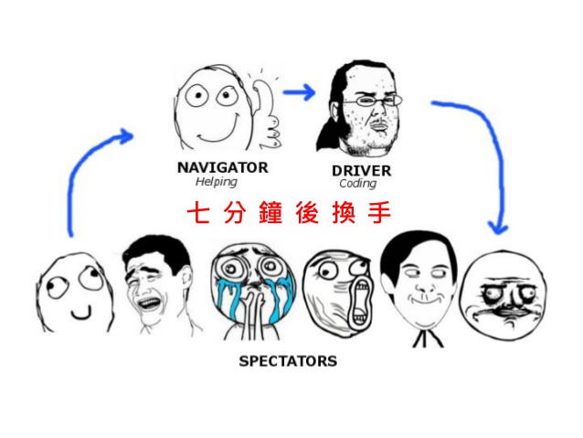

天天写业务代码的那些年，我们是如何成长过来的
===

> 比起写业务代码更不幸的是，主要工作是修 Bug，bug，buG, bUg。

在一家大的公司里，不同的人总会有不同的运气：

 - 运气好的人遇上一个好的项目，升职加薪，从此就走上了人生的巅峰。
 - 运气差的人摊上一个差的项目，升不了职，少加了薪，并且还获得不了技术成长。

我刚毕业那会儿，所在团队的主要工作是，维护一个『又老又旧』的系统。比起写业务代码更不幸的是，我们的主要工作是修 Bug，bug，buG, bUg。

那一年多里，尽管都是维护旧系统和少量的新需求，我还是在飞速的成长~~。而来源主要是：

 - 组内技术活动。
 - 花时间投入练习。
 - 假想项目的重构。
 
当你在有限的条件下，还能做出一定的成绩，到底还是相当有成就感的。

只修 Bug 是怎样的一种体验
---

在这样的项目里：

 - 工作一个月时，你打开 Backlog，看看需求卡，发现那张需要三个人天的卡，好像会更有挑战一些。
 - 工作两个月时：你打开 Backlog，看看需求卡，发现完成这卡只是时间问题。
 - 工作三个月时：你打开 Backlog，看看需求卡，发现清清楚楚地知道修改哪一行。

有一天，业务人员来了一个新的需求。虽然只是加上一个新的导航，但是你总会小开心一会儿。

可你来到这样的项目时，你总会想着离开，向自己的 Buddy、PM 、Sponsor 诉说。可惜，你只是一个毕业生，太年轻了。对于你来说有挑战性的项目，不会考虑要你的。在你的感觉里，那种『自己是大公司的轮子』的感觉就特别强烈。多你一个不多，少你一个不少。你走了也不会影响这个项目，毕竟招一个人来修 bug，还是蛮轻松的。因此，这个项目走了一个又一个技术好的人，却也来不了一个技术好的人。

时间一久，每个人都充满了危机感。我们总是担心：**当你换到另外一个项目的时候，别的项目 PM 会考虑你么**——因为你是来自这个没有挑战性的项目。这个时候，你已经无路可走了，**你必须去提高你自己**。

当别人救不了你的时候，你只能自救。当别人救不了你们的时候，你们也只能自救。幸运的是，我们当时还有足够的时间，可以提高项目组的水平。于是，我们对组织了**各种的组内技术分享、workshop、培训等等**。

当你有强烈的改变意识的时候，那么事件就会变得很简单。真正可怕的是温水煮青蛙式的，而当你面对的是温水，你总会不断尝试去离开。

组内技术活动
---

当你们项目无聊的时候，总会空余一些时间。上进一点，就会创造一些学习的条件。有了条件，那么剩下的就是靠人为了。

于是乎，我们在每周挑取了两个时间，做一些技术的事情。包含了下面的一些内容：

 - 技术分享。
 - workshop。
 - kata。

不同的活动都有不同的目的，有的可以提高演讲者的技术能力，有的则是可以一起提升能力。下面就让我们详细了解一下不同的活动。 

### **技术分享**

想必大家都已经知道这个是什么了~~。当时的情况，大概是我们七个人里，每周会有两次技术分享。分享的主题会比较广泛：

**你最近在玩的技术栈**。当你们所用的项目技术栈，比较老旧的时候，就想不断地去尝试新的技术。在工作之外，便会去玩一些『新鲜』的技术栈（坑）。它就像是一股清流，即使不能帮你清除旧的污水，也能让人们看到一丝希望。而且除了能提升团队的视野，还可以将之视为替换现有架构的探索。

**项目相关的技术及业务**。在没有结对编程的项目里，共享知识对于团队来说是一个头疼的问题，而技术分享就是最简单的方式。不过，对于新人来说，**让他们做相关的技术分享才是最好的方式。**这也视作为我们对新人的考察：

 - 对于项目的了解程度
 - 找到缺少的相关知识
 - 培养新人的表达能力

在项目上，这几乎是每个新人都会经历的一个分享~~。

**特定主题的技术分享**。即，我们限定好一个大的主题，每个人挑选一个特定的主题来分享，它可以人为地提高整个组在某一领域的水平。当时我们做过 SOLID、设计模式、前端相关等特定主题的分享——每个人挑选设计模式中的一个模式，然后做相关的技术分享。当你做分享的时候，你对这模式就比较了解；而别人做分享的时候，也能引发你的思考。由于这些主题之间的相关性比较强，它可以加深对这一领域的印象。

**其他杂七杂八的内容**。过多的技术分享，可能会导致大家精疲力尽，因此就会有一些技术之外的分享。比如，你喜欢的各种动漫啊、知乎上流行的程序员女装啊等等。

而就效果来说，技术分享对于分享者的能力提升比较大，听众则是知道有这个东西，启发性一般都会比较少。如果是针对于提升能力来说，应该采用 workshop 等方式。

### **workshop**

当项目上要采用一个新的技术栈时，仅仅中是一个技术分享是不能解决问题的，你还需要有 workshop 这样的东西。比如你们将在新的项目里引入 Next.js，那么这个时候就需要有一个 Next.js Workshop。由组织者来规划每一步的内容，第一步做什么，第二步做什么，等等。参与者则是单独或者结对的形式，按照组织者的步骤一步步往下来做相关的技术练习。比如在 workshop 开始前，先 clone 并搭建好基础代码（hello, world）。开始的时候，便是先实现一个简单的 header，然后是添加样式等等。

也因此在这样的 workshop 里，我们不仅可以听过相关技术栈的知识，也能掌握一些相关技术栈的具体实践。

### **kata**

一种编程练习方式，针对某个题目反复进行操练，达到熟能生巧的目的。简单的来说，就是你一直练习某一个特别的东西，直到你习惯了。比如，对于 TDD（测试驱动开发，先写测试，并由测试驱动出功能） 的练习。

在平时工作的时候，我们不会总是习惯于 TDD 的流程：测试 -> 实现 -> 重构。特别是，当你的卡就要被打包到新的 Release 包时，**先实现总是会保证交付的**。又或者是，当你对代码库特别熟悉的时候，你可能两三分钟就改完代码，然后去喝咖啡，再回来花个十几分钟写一个测试。而当你不熟悉 TDD 的时候，你更不会采用这种方式，你会的可能就是 Test First。为了将 TDD 的思维融入你的想法里， 你就需要大量的这种练习~~。

在这个时候，我们就需要严格的按照步骤，一步步往下执行。以便于在将来，我们可以严格的按照这些步骤来执行。

除此，还有一种方式可以做，只是我们没有在这个项目里实施。

###  **dojo**

dojo，（日语：道场）。在西方世界，dōjō 一词主要指的是一个专门针对日本武术的训练场所。在敏捷团队里，Dojo 的进行方式比较『诡异』，也比较有意思。

如果你了解过结对编程的话，可能就会对两个人的结对过程比较感兴趣。按我的理解，结对编程存在着三种不同的阶段：teaching（引入门），driver-navigator（有经验与新手），结对（有经验与有经验）。即在实现功能的时候，两个人会轮流写测试和实现功能——你先写测试，我实现功能，然后换角色。而 Dojo 就是一堆人在轮流写代码：

即在有限的时间里，每个人上去实现同一功能的代码。

如，A 实现了测试，B 上去实现业务，C 上来重构。D 上来看了看，你们写的代码都是 xx，于是 Revert 之前写的代码。可惜 D 的时间也只有七分钟，所以 E 上来 Revert Revert。。。

笑~~

花时间投入练习
---

限于之前已经有相当多的文章，介绍练习相关的技巧，如：

 - 《Github 365天: 给你一年的时间，你会怎样去提高你的水平》
 - 《我的成长四步曲》
 - 《我并不聪明，只是多练习和思考》

这里就先略过去了~~，有兴趣的读者可以阅读上面的内容。

假想项目的重构
---

与上面的技术活动相比，这是一个对于业务更有价值，并且更容易说服别人的方式。

1. 学习别的项目的技术栈，然后将之应用到现有的系统上。
2. 使用一个新的技术栈练习， 以此作为技术支撑，在未来替换现有的系统。

Fork from others。

小结
---

