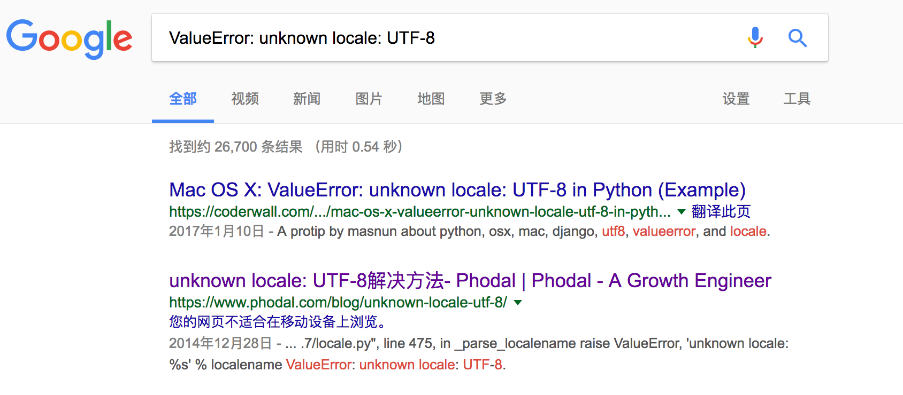

程序员，你真的清楚你遇到的问题吗？
===

> 作为一枚程序员，我们天生就是来解决问题的。在你不知道你的问题之前，我帮不了你，Google 也不能帮你解决问题。

大概从去年开始吧，我在思考着提升软技能上的能力。对于问题来说，能力可以分为这么几种：

 - 如何识别出问题的关键所在？分析能力
 - 如何表述清楚问题？提高表达能力
 - 能否以更清楚的形式来表达问题？如使用故事的手法？
 - 如何来指导他人解决问题？Coach

那么问题来了，当别人问你一个问题的时候，你会怎么去分析它呢？首先要对这个问题进行分类，因为**很多问题是无解的**。比如说，初学者问你：

 - 如何在 24 小时内成为前端工程师？
 - 我已经 30 岁了，应该不应该转行当程序员？
 - 大三法学生应不应该为了转行（web前端开发）而放弃司法考试？

很多时候，你只想要别人的肯定而已。

问题来源的分类
---

作为成长的一个方向，我开始去寻找一些咨询类的书籍，才了解咨询师可以分为好多种。比如说： 技术、解决方案咨询。我们需要有人来解决某个特定的问题，这个的问题是：已知的问题，但是找不到合适的解决方案。

常见的比如说，你需要一个团队转型方案，你需要有经验的人来帮你，以期降低相应的风险指数。

又比如说，我们知道我们遇到了问题，但是我们清晰问题出自哪里。

还有一些就是，我们不知道我们不知道，我们想预测一下『黑天鹅』。

简单的来说，就是『约哈里之窗』。

最后，还有一种情况是：出于政治目的，我们需要你来证明 B 方案是比 A 方案更好的。事实上，这种问题在我们的生活中更常见。我在心里已经有了答案了，我咨询你只是为了得到一个肯定，然后就可以实施这个方案。即使，你不肯定这个方案，我也会实施的——这就是『灰犀牛』，**我们早就看到却又视而不见的危险**。

（PS：不可预测的黑天鹅，可预测、可感知、可预防的灰犀牛，他们都是两种奇葩。）

也因此，很多时候，被提问的你就是那个背锅的大头。

如何去解决问题
---

当程序员遇到一个问题时：

 - **技术问题**，第一反应是 Google，第二反应是找个地方提问。
 - **职业问题**，第一反应是找信得过的，有经验的程序员。
 - bug，第一反应是这是一个 Feature，笑~~。

这些方案已经足够的清晰了。你也在很多地方看到了如何去解决问题了，我只是又重复了一遍了。当我们去询问别人如何来解决一个问题时，需要有这么一些步骤：

 - **正确识别问题**。我需要在一开始的时候，想清楚我到底遇到什么问题。这个步骤很简单，只需要看现象就可以了。
 - **描述清楚问题**。我已经找到合适的地方，合适的人来提问了。这个时候关键的点是：如何描述清楚我们遇到的问题。
 - **寻找解决方案**。有些时候，你要的答案会被直接抛出来。有些时候，被提问者会让尝试 A 再尝试 B。有些时候，你只能自己去解决问题。
 - **解决这个问题**。最后，你需要一些时间去解决问题，并学会做一些总结。

### 如何识别问题

作为一个程序员，首先**你需要尝试自己去解决这个问题**。我经常在 QQ、微信群里看到一些问题，明明就是自己搜索一下就能解决的问题，却还要去问别人。比如说：

你只需要简单的搜索一下：

现在，你遇到一个请求的参数没有发到后台？你会怎么做？ 使用浏览器的 Network 工具，查看请求是否发出去了:

   -  如果请求发出去了，那么问题就是后台的问题了。
   -  如果请求没有发生去，那么就是代码的问题了。如果是前端代码的问题的话，那么是不是这个值是空的？或者参数没有在 data 里？

再进一步去看这个问题，那么你可能就解决了这个问题了。

当你已经尝试了多次，并失败了，那么你就可以寻找合适的人，合适的地方去提问，比如说：

### 如何表述问题

向我们决定提问的时候，我们需要描述清楚我们的问题：即，**我们需要在别人的脑子里能复现问题**。我们需要描述一下当前遇到的问题：
 
  - 如何操作才出现这个问题，即提供一个重现问题的步骤。
  - 提供问题的上下文，如语言版本、操作系统等等。

如果是代码的话，请使用**高亮**、**高亮**、**高亮**的编辑器，或者截图。

总之，就是让被提问者有一个清晰的问题印象。

### 如何解决问题

列出你所需要的解决方法，一一验证它。

绝大多数情况下，只有你才能解决你的问题。我只能教你方法，或者 Coach 你，才能帮你解决这个问题。

