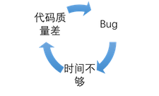
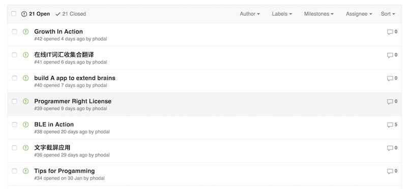
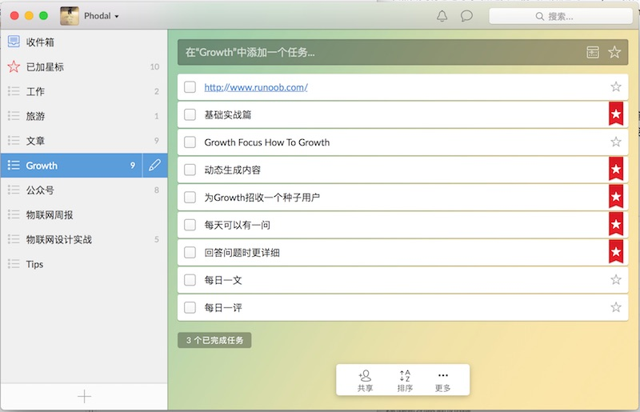

#前言

我的成长四步曲
---

在我成长初期，我制定了一些计划来实现下面的一些能力：

1. 能做到你想做的: Tasking与学习能力
2. 用更好的方法来实现功能
3. Better Code & Architecture
4. 运营(Growth Hacker)

除了第一步，每一个步骤都花费了相当长的时间来学习，光在学习方面就差不多一年了。

### 能做到你想做的: Tasking与学习能力

虽然这看上去是一件很难的事，但是也不是一件很难的事。这也不依赖于你是否对某一个技术栈的理解，这只实际上只是学习能力的一种体现。


在扯这些废话之前，先让我们来看看我们是如何实现一个功能、应用的。这也是在Growth里提到的Tasking：

1. 有一个明确的实现目标。
2. 评估目标并将其拆解成任务(TODO)。
3. 规划任务的步骤(TODO)
4. 学习相关技能
5. 执行Task，遇到难题就跳到第二步。

以本文的写作为例，细分上面的过程就是：

1. 我有了一个中心思想——在某种意义上来说就是标题。
2. 依据中心思考我将这篇文章分成了四小节。
3. 然后我开始写四小节的内容。
4. 直到完成。

而如果将其划分到一个编程任务，那么也是一样的：

1. 我们想到做一个xxx的idea。
2. 为了这个idea我们需要分成几步，或者几层设计。
3. 对于每一步，我们应该做点什么
4. 我们需要学习怎样的技能
5. 集成每一步的代码，就有了我们的系统。

所以，实际上这并不是考验你技术能力的点，而是考验你如何划分任务和学习能力的点。在我不断地实现一个个系统的时候，最后我才意识到了这一点——学习能力和Tasking才是最重要的。换句话说，你现在学会什么并不重要，重要的是你以后有没有学习的能力。

有了一直想着过安逸的生活，所以就会安乐的死去。不过反正人生在世，自己开心就行，不要管别人怎么说。随后，我发现大部分我想到的都可以实现。

那么问题来了：

1. 用铅笔写字也是写，用钢笔写字也是写，用电脑打字也是写——到底要用哪个工具来写。
2. 用楷体来显示也是显示，用宋体显示也是显示——到底要怎样的实现。

这实际上就是：用更好的方法来实现功能。

### 用更好的方法来实现功能

对于这一步来说，有太多的东西值得去探索:

1. 更好的架构
2. 更好的工具
3. 更好的语言
4. 。。。


对于语言这一点上来说，Python和Ruby是两个不同的极端，不过看上Ruby是继承Perl的思想的基础上，就不多说了。Python，一个问题只有一个方法;Ruby，一个问题有几个方法。因而在这两个语言来，想要快感就用Ruby，还有近年来流行的Scala。想要便捷就是Python，不容易出现别的问题。

而这些只是我得到的结论，每个人都会得到不同听结论的。因而，探索是一件很有意思的事~~，如图：


所以实际上，这一步是去探索一个更广阔的天空。我们需要知道不同的语言和技术栈的一些优势，了解并知道如何去应用即可。

如，以前我用的是Django的RESTful方案Tastypie管理来解决问题。后来，又发现了Django REST Framework，又用它实现了原来的逻辑。大四时，我发现PHP语言中的Laravel在RESTful这件事情上，似乎很有表现力，并且更容易“部署”——LNMP。接着实习时，发现Java在部署上更不错，它只需要一个Java包。而这个过程，只是出自于部署方面来考虑问题的。

即使现在我是一个使用Node.js的人，我还是觉得Java的打包就是优势。

在探索的过程中，我们就知道**挖掘技术哪家强**？

### Better Code & Architecture

在实际编程的过程中，我们就会遇到很多代码问题。在这时，我们尽管有好的架构，然而并不能从根本上解决问题。只能保证从蓝图上看是对的，而不能导致质量问题。


代码的腐烂都是源自于平时的工作习惯问题，而在很多时候是需求导致的。这些看上去就是噩梦——加班，没有时间学习，效率低。没有时间学习，效率低，加班。


而对于代码质量来说，也是如此的一种循环：



而在这时可以学的东西可多了，如Bad Smell，重构，设计模式，编写测试等等。

最后，我只得到了一个短句：

> 重构到设计模式

好的代码是重构出来的。

再往深层次之上就是架构，而架构往往是一种不容易得到的。尽管我看了一系列的书：

 - 《领域驱动设计》
 -  《企业应用架构模式》
 -  《领域特定语言》
 -  《恰如其份的软件架构》
 -  《面向模式的软件架构》
 -  。。。

最后，我还是依据一本书的书名，才领悟了一本书的书名《浮现式设计》。也是同样的话：

> 好的架构是演进出来的。

而这些都依赖于我们的实践，听信别人说的话，并不能让我们学会什么。只有自己做了，才知道什么是好，什么是不好。

### Growth Hacking

当我们有了一个好的Idea，一个好的架构以及一份良好的代码，并且我们还能将其执行下去。那么，我们还需要什么？


这也是我现在正在尝试的领域，也是过去我想做的，但是却找不到一个好的方向。后来，想了想就有了Growth这个APP。毕竟从一个领域到一个新的领域，最好是通过现有的领域作为过渡。

自媒体正在最近几年内崛起，同时由于聚合网站的存在，信息在不断地爆炸。一个好的作品、文章要传播起来已经越来越越难了。

在现有的领域里，知乎、微博、公众号已经开始在垄断人们的碎片时间。一个东西可能在火了几天之后，你就很难得到他的信息了。

所以在适当的时候去推销，在适当的时候持续下去。

### 小结

在那之前你需要明白的一点是，你要成为一个怎样的人？是行业的专家？还是领域的专家？等等！


我想的是一直可以做一些有趣的事，单纯深入一个垂直领域对我来说太枯燥了。对于我来说，我只会在造轮子的时候去研究一个轮子。而不是深入研究某个轮子，我会得到造某种轮子的方法。我只会在创造一些有意思的东西的时候，才会深入某个领域去学习。而不是为了深入某个领域，再去学习这个领域的知识 。。

每个人都可以用不同的方式成长，知道自己的喜欢的然后去计划。

# 内容之美

## 人生苦短，为何不写作呢？

## 分析篇：什么样的文章受欢迎？

### 文章的类型

#### 搜索引擎：完成工作

#### 聚合网站

#### 社交与新媒体

#### 小结： 大连接

## 创作篇：写作的要点

### 文章类型

#### 技术细节型

#### 干货型

#### 实践总结型

#### 杂谈与鸡汤型

### 写作要点

#### 标题

#### 小标题

#### 内容——函数体

#### 引言——README

### 文章排版

#### 可读性

#### 代码高亮

### 收集灵感

# hello, world

# 影响力

影响力 => 可信度和信任

## 分享和创造

### 为什么人们关注你？

## 技术、影响力&赚钱

### 代码、写作与分享

## 提高影响力

### 跨平台的平台：ID

# 高效

## 目标

## 激励

## 有节奏的休息

经常被问及为什么我可以做这么多的事，换句话来说也就是为什么效率这么高？过去我的答案里，要么是**手快**，要么是**不加班**。后来，我发现事情并没有这么简单，于是我便想着写几章文章整理整理。

在过去的两年里，保持了GitHub近两年的连击，存档了上百个项目，还凭借18k个star上榜“GitHub Star榜Top 100”。除此，审阅了两本物联网相关的书，编写了一本物联网相关的书，和基友一起翻译了一本硬件相关的书、一本物联网相关的书，在GitHub上写了开源的电子书。

保持高效的第一要点是，**休息**。问题是我们可以怎样休息呢？

 - 睡觉
 - 吃饭
 - 走路
 - 洗澡
 - ...

这些都可以是休息。当我们讨论休息的时候，并不是指在睡觉。只要不是在忙与当前编码相关的事务，那么我们就是在休息。事实上，我们可以将“休息”这个词转变化**恢复精力**——这才是高效的第一要点。

### 休息时间

先让我们来看看在一天里，我们有多少时间是在休息的？

 - 睡觉，这是最基本的
 - 吃饭，一天三次。吃饭还得排队，又是一个多好的时间。如果你加班的话，那么你可能就是四次了。
 - 上下班时间。如果你离公司很近，那么你可以在下班的时候去逛逛。
 - 午休，运气好的话，你还可以在桌上趴会。
 - 喝水、上厕所等等。

让我们来计算一下，大致时间花费：

 - 睡觉，7~8个小时
 - 吃饭，3 * 15分钟左右 = 45分钟
 - 上下班时间，0.5小时 * 2 = 1小时
 - 午休，0.5~1小时
 - 喝水、上厕所，一天加起来也不会超过0.5小时吧。

这样算下来，一天有一半的时间都可以是休息时间。如果真的可以这样的话，那么我想你不会遇到效率的问题了~~。

#### 我的作息

之前在西安时，我作息差不多是这样的：

 - 早上七点钟起床，刷牙洗漱，然后刷GitHub，八点出门坐车。
 - 中午十二点半吃完饭，休息半个小时左右，刷刷GitHub，或者在翻译书。
 - 下午六点下班，早期坐公交回到家里，吃完饭会先睡一觉。因为是开着灯睡的，大概就十分钟左右。后来，坐上“小猪巴士”，直接在车上**睡一觉**。
 - 晚上，八点半左右才会开始写代码，十一点半上床睡觉——99%的时间是不熬夜的。

熬夜，对于我来说基本是百害而无一益，很容易影响第二天的体能和思维。因此从某种程度上来说，可以保证我有足够的精力。

而到了深圳后，主要的变化就是下班后，变成了六点走回家——50分钟左右，主要目的就是改善体能。由于这个季节，深圳的温度比西安高，回到住的地方睡不着~~，还在培养中。

并且在晚上时，有了更多的改变：

 - 忙时，十一点合上电脑、手机静音，拿起Kindle或者纸质书阅读，或者白纸装逼。
 - 闲时，十点便开始看书了。

毕竟，对于像我这样内向性格的人来说，独处才能恢复精力。对于外向性能的人来说，可能出去找几个朋友High一下就能恢复精力。

### 有节奏的休息

当你发现你养成习惯后，你就很容易进入状态。比如我在10点时，很容易就可以进入写作状态。当我按时11点半睡觉，我就可以很快进入状态，这些都是习惯造就的。

#### 按时睡觉

小时候，我们都是9点钟上传睡觉的，5，6点多起床。。。然后去叫叫隔壁的大哥哥，大姐姐出去玩。

长大了，我们都是11点钟上传睡觉的，然后7，8点起床。。。然后被隔壁的小屁孩叫醒。

从整体上来，熬夜会对身体和精神产生相对比较大的影响。如果你对**星期一综合症**或者**假期综合症**有所了解的话，那么你就会知道，只是因为你改变了习惯。

当然，如果你已经习惯了长期熬夜，并且没有负作用，那么你还是相当不错的~~。

这让我想到了猫，所以猫白天根本不理你了~~。

#### 番茄工作法

番茄工作法对于我来说，不是那么管用——天生喜欢多动，并且每天我的事务比较单一，就是编码。之所以会出现在这里，是因为它对健康有益。

我正式采用番茄工作法的原因是，在客户现场工作时，影响到颈椎了，加之我在改善尺神经卡压的影响。

这一点特别适合在工作上用，每工作25分钟，就可以休息5分钟。

所以，请使用番茄工作法作为合理的休息理由吧~~。对自己狠一点，就是对资本家好一点——除非你是资本家。

#### 碎片时间 -> 玩吧

碎片时间就适合刷刷朋友圈、逛逛微博、看看美女，看书什么的一点都不适合。

碎片时间根本不适合学习！

碎片时间根本不适合学习！

碎片时间根本不适合学习！

学习需要有高度集中的时间，你才能集中精力学习。

对了，如果你没有女朋友的话，那么你应该趁这个时间找人多聊聊天天。

#### 适当的有氧运动

>　每天应该适当做点有氧运动，如果没有女朋友的话，那么你应该出去跑步、散步啊。

只所以强调适当是因为，大量地运动不仅需要占用了你相当多的运动时间，你仍然需要相当多的时间来恢复。

而有氧运动并不仅仅局限于传统意义上的运动：跑步、打球，还可以是拖拖地。

如我最近在家里练习羽毛球颠球——转移眼睛的注意力，也算是适当的有氧运动。遗憾的是，不能在工作的地方练习。

### 小结

> 最近软件行来的的用人趋势是把人当成富士康工人用。

要成为一个大牛，就需要准备一场长期的战斗，培养自己的状态。而不是在华为干个十几年出来了，再用这十几年赚的钱去买健康，一不小心挂了怎么办？

要知道，你已经错过进入大公司最好的时机了——现在进去只能成为新一代的**富士康工人**。**你对外所说的每一句话，每一张截图，将成为你被Fire的证据。**

## 习惯

## 精力管理

## 快捷键

# 练习的艺术

为了更好的练习，我们可以做一些事情来提高练习的意愿：

 - 创建 Ideas 列表
 - 技术创新
 - 实践 

## 管理你的Ideas

有一句话很有意思——我们就差一个写代码的了。但是，我们经常说的是我们缺少一个idea。过去我也一直觉得我缺少一些Idea，今天发现并非如此，我们只是缺少记录的手段。

大概是在七个前，有一天我在Github上闲逛的时候，找到了一个代码库，然后习惯性的点开了作者的Profile。发现了一个名为ideas的repo，尽管里面只有简简单单地几个idea。但是这让我发现了一个新的大陆，在那之前我一直用OneNote记录我的idea（用的是Nokia Lumia 1020)。

而打开OneNote记录Idea，并不是很方便，有时候是代码，有时候是一篇博客的链接，有时候只是一段话。而且Idea出现的时候往往是在浏览一些网站的时候，Mac OS上的OneNote与Windows Phone的同步又有问题。

紧接着，我开始用Github的README.md和Issues来管理我的idea：[https://github.com/phodal/ideas](https://github.com/phodal/ideas)。

### Github管理Idea

半年时间过去了，我的Issues列表里已经关闭17个Issues，大部分是已经完成的idea。而在Open的列表里还有着12个还没开始、或者只进行了一部分的ideas。稍微看了一下，每个Idea大概隔了七天，毕竟是可遇不可求的。

如我最近解决的一个问题是——项目技术栈趋势图。而这个Idea从出现到实现只花了一天的时间，或者这算不上一个真正的Idea。而这个Idea则是依赖于另外一个Idea——技术树。同样的例子还会有很多，这和技术的演进是差不多的，Idea也是一点点演进出来的。

#### Issue

Issues一直是一个神奇的存在，你可以用它当成博客，然后下面就可以有评论。Disqus也许可以和Github合作，这样他们就会有一个巨大的市场，当然这只会是一个玩笑。

Issues是一个非常不错的『工具』，因为它可以打上Tags，你就可以通过此为你不同的Idea进行一个分类。并且每每有一个idea完成的时候，就可以关闭这个Issue了。这就好像修复一个Bug的感觉。

对于每个Idea相关的一些内容，我们都可以以Comments的形式添加相应的内容。

#### 展示Idea的README

README都会是一个项目的介绍，而且我们也可以在上面汇集我们的所有Idea。如在我的idea列表的README里已经有长长的一堆了。。

每个项目里，都会有一个简单的介绍，如EchoesWorks:

简介：Next-Generation Tech Blog/Presentation Framework

特性：

 - 支持 Markdown
 - Github代码显示
 - 全屏背景图片
 - 左/右侧图片支持
 - 进度条
 - 自动播放
 - 字幕
 - 分屏控制


在一些项目里也会有一些长长的介绍，及截图。


## 程序员如何批量生产idea

作为一个程序员都有超越BIll Gates，又Linus Torvalds一样的梦想。当然也可能没有那么远大，但是也会有当上CTO这样的想法。

一直在考虑这样的问题很久，直到有一天有了一些新的想法——这也是可以练习的。我们都知道创业就是集齐一些条件，然后持之以恒地做下去。而要集齐条件是一件很难的事，但是要练习确是一件很容易的事。

如果你可以每天抽出时间做一件事，那么再好不过了。如果一直在加班，那么这件事对你来说一定是很困难的一件事。抽出这些时间，然后做一些有针对性地学习和练习，那么就会离这个目标又进一步。

所以，这其实是一篇在说怎么去练习创建一个成功的产品的文章。这些原则可以很容易运用到创建一些开源项目上，又或者是其他类似的事情。如果你看过之前那篇《程序员如何艺术的提升技术、影响力&赚钱》，那么我想这篇文章对于你去创建一个Side Project也是很有意思的。

### 如何产生Idea：从「只差程序员」到「不差Idea」

过去我也一想在想这个问题，为什么我也没有一个好的Idea。后来，我发现只是我没有去记录，再后来我发现光有一个好的Idea也没啥用。

####「只差程序员」

「只差程序员」是一个很值得思考的问题，但是也是一个很有意思的问题。作为一个程序员，我们很容易发现对方的Idea，实现上真的不怎么样。而且如果他们差的不只是一个程序员，他们需要的是一系列的程序员。还有更多的人员，他们只是觉得程序员是万能的。

这就回到了一个问题上，既然我们是一个程序员，那么我们就占据着这个世界上的人和了。如果天时是一个好的时机的话，那么就是值得去等待了。但是作为地利的Idea，却是可以练习出来的。

这可能是你听过最有意思的笑话了~~~。

在我看对刻意地练习进行了一番尝试之后，我发现这其有无限的可能性。

### 对创新的练习：产生Idea

开始瞎说之前，让我们先看看英特尔®高级院士Gene Meieran对创新的三种类型定义：

 - 突破性创新，其特征是打破陈规，改变传统和大步跃进；
 - 渐进式创新，特征是采取下一逻辑步骤，让事物越来越美好；
 - 再运用式创新，特征是采用横向思维，以全新的方式应用原有事物。

现在，我们已经有三个可以练习的领域了。

**等等，我们从哪个领域开始？**
 
这是一个再简单不过地问题，自然是从我们擅长的领域开始——计算机。又好像是一个说了等于没说的答案，而这也是最容易练习的领域了。

在我们日常的编程工作中，我们会遇到各式各样的问题。有的人因此而创建了许多工具，有的人创建一些公司等等。只是因为这些是我们的痛点，而如果一个痛点是很多人的痛苦，那说明这是有希望的一个想法。因此，上面的三点也是三个可以练习的点。对于突破性创新来说，可能会比较难以在早期进行练习。但是对于渐进式创新来说，却是一件很容易的事。

创新是一个很有意思的话题，人们都在不断地鼓励创新。到底什么才算得上是创新？

作为一个企业想要有创新的目的莫过于：想活得更久。在多数的情况下，限制企业创新的主因便是企业本身的组织结构问题。如果一个在市场方面占有领先地方的公司做了很多创新，必然会更受尊重。Google在这方面做得不错，然而也饱受批评——毕竟，公司都是以营利为目的。如果一个产品本身达不到预期的营利要求，那么它必然会被关闭。

#### 渐近式创新：减法

在很早很早以前，我们都用过jQuery。然而这个库太大了，在早期他根本就不适合用于移动领域。相信当时也有相当多的人对其叫苦连天，于是有一个人写了一个框架叫Zepto——一个兼容jQuery API的迷你版jQuery。

去除掉那些我们不需要的功能，我们就可以获得一个新的产品。毕竟，每个人的口味都是不同的。功能越多的东西并不意味着越好，好的设计应该是添加不了新的特性，也删除不了特性。

兼容旧的浏览器本身就不是一件令人愉快的事，如果我们可以像React一样抛弃旧有的浏览器，那么我们在开始的时候就能走得更快。

#### 再运用式创新

对于这一个点就更有意思了。就是找以前的人做过的Idea，重新做一遍。在旧有的技术下不能完成的Idea，在新的技术和环境下就有可能完成了。如出生得太早的Palm掌上电脑，如果在一个新的时机重新创造的话，那么我们就可以超越原来的产品
 
实现上，你也发现了上面我们说了一堆费话。因为没有行动的话，说太多也是没用的。

记得我们的上上次Hack Day的主题是慈善，我们想做一个O2O捐赠（ps: 当然这个项目是开源的，代码放在GitHub上：[https://github.com/icharity](https://github.com/icharity)）。对于我来说，这是一次彻底的自由技术选型。

我们平时的主要语言是Java、Ruby、JavaScript，我们还使用了个古董级别的搜索引擎。尽管应用现有的系统架构可以完成我们的功能——搜索引擎保存、搜索数据，用Java语言来实现业务代码。但是在这样一个“伟大的节日”，我们还是自由地去创新。

于是，我使用了Django作为主要框架，ElasticSearch作为数据持久化，使用Node-Wechat来处理用户输入。接着在这三天里，就Happy的去写代码了。Blabla，然后就可以欢快地和人们去ShowCase了。

而这便是一个很好的再运用式创新，而这也是一个很通俗的例子。现在我已经想到了一个更简单的例子了：以前当我们不懂得设计模式的时候，我们写的代码可能看上去可以重构，但是又找不到一个好的点。而有了设计模式之后，我们便可以在我们学到的新思维用到旧有的代码里。

对于上面的例子来说也是相似的，我们已经有了旧有的技术模式，只是现在我们有了新的业务。新的业务可以匹配到我们旧有的技术框架里，旧的技术框架可以得到复用。

#### 渐进式创新

渐进式创新是一件很有意思的事，他已经和我们上面提到的“减法”相矛盾了。但是这一点似乎就是很多软件的盈利点所在——通过添加新的功能来赚钱。这也是一个非常容易理解的点，你只需要添加一些新的特性即可。不过，我想这一点已经到处都用到了，没啥说的~~。

在一次Hackday里，我们（我当时是实时生，只是在打酱油~~）用WebRTC、Arduino、Android手机、四轮小车作了一个小机器人。我们搭建了一个WebRTC的Server，手机与四轴小车做了一个漫游者，然后你可以在网页上看到小车看到的东西，并且你还可以在通过WebSocket在网页上操作他。

而我们的新Idea，便是用Oculus替换掉浏览器——我们可以用Oculus来观看远程的画面，当然还应该可以移动。尽管改变看上去很少，但是还是充满了技术挑战。

而这也是多数产品的一种路线，而这是这种路线让一个又一个的程序员加班。因为Idea本身不一定可靠，没有人能保证他们的想法一定可行。但是如果程序员不是那个出Idea的人，那么就只能任人宰割了。渐进式创新是很保守的技术创新，在现有的产品的基础上加以改进——算是加法创新。

### 开始记录你的问题/Idea

记得在那篇《[如何去管理你的Idea](https://www.phodal.com/blog/use-github-manage-idea/)》中，我们提到了用GitHub来管理Idea的想法。但是在上面记录的都是一些公开式的Idea，我们可以记录一些相似的问题。除此，我们还有一些更好的工具。

**但是，养成记录问题和Idea的习惯很重要。**
**但是，养成记录问题和Idea的习惯很重要。**
**但是，养成记录问题和Idea的习惯很重要。**

如我开始将各式各样的Idea，向我的[GitHub Repo](http://github.com/phodal/ideas)里放，如下图所示：



里面已经堆了一堆想法，有的是重复的造轮子，有的是造一些新的轮子。隔三差五地创建一个新的Issue，虽然不一定及时完成，但是可以放着看看。等老了，看看有哪些Idea已经被实现了。

除此，有一些比较隐私地Idea，会用【奇妙清单】来管理：



想法先记下来，然后再说~~。


## 造轮子

造轮子是一种快速的学习方式，而还有一种进阶则可以是从Github中生成轮子。

### 从GitHub生成轮子

使用GitHub来生成轮子，简单来说就是：  

1. 查看很多Github项目的源码及提交历史

2. 写胶水代码生成自己的框架

在这里分享之前造的几个轮子的过程：  

#### SPA框架

两年多以前，当时我们项目用的技术栈是：**Backbone** + **Mustache** + **jQuery。**在我们当时的环境下，主要组成有：  

1. Backbone提供了一个Router  
2. Mustache提供了模板  
3. jQuery抽象了DOM  
4. Ajax请求  

所以，这就是我造的第一个轮子的重要组成部分。  

接着，我就开始造轮子了：我称呼这个框架为Lettuce, [GitHub - phodal/lettuce: Mobile Framework for Romantic. 简约的移动开发框架](//link.zhihu.com/?target=https%3A//github.com/phodal/lettuce)。  

我参考了一本名为《Building A JavaScript Framework 》的电子书，以及《JavaScript框架设计》一书。因为没有任何框架的设计经验，所以只好试图按照书上的一点一滴来进行。在这个过程中，我开始深入JavaScript。  

从 [https://github.com/munro/self) 这个库中，我开始创建了自己的类的用法。  

接着，开始写Ajax，照例还是参考了jQuery和Zepto的代码。同样的还有Event、Promise等等的一些类。  

然后就是Router，源码来自于：https://krasimirtsonev.com/blog/article/A-modern-JavaScript-router-in-100-lines-history-api-pushState-hash-url，又参考了早期的Backbone代码。  

以及模板引擎，照例代码也不全是我写的，用的是http:////ejohn.org/blog/javascript-micro-templating/

最后就是一个简单的PageView:

```javascript
    var SimpleView = new Lettuce.prototype.Class({});

    SimpleView.prototype.init = function () {};

    SimpleView.prototype.render = function (template, elementId) {
        document.getElementById(elementId).innerHTML = template;
    };

    var simpleView = {
        SimpleView: SimpleView
    };

    Lettuce.prototype = Lettuce.extend(Lettuce.prototype, simpleView);

```

这其中最复杂的部分就是结合别人的代码，换句话来说，就是**写胶水代码**。Blabla，最后我就有了一个SPA框架。  

相关文章：[一步步搭建JavaScript框架——初始化项目](https://www.phodal.com/blog/build-javascript-framework-init-project/)  

**不过，这其中参考了几十个框架，这点对提升自己很重要。**  

#### Slide框架

八个多月前，当时的情形是我需要有一个可以定时放映地Slide框架，而当时大部分的框架都不能满足我的要求。  

实际上我只需要一个定时的功能，而Impress的最新代码又太复杂了。  

接着，我看了Github上的提交历史，我发现挺简单的，就自己创一个新的框架，称为[GitHub - phodal/echoesworks: Next-Generation Tech Blog/Presentation/Slider Framework](https://github.com/phodal/echoesworks)。  

我需要下面的一些元素：  

1. Markdown解析器  
2. Slide框架  
3. Github代码显示  
4. 进度条  

同样的，我在Github上搜索不同的组件，最后再把他们结合到一起。  

相关文章：  

1. [EchoesWorks —— 打造下一代技术Blog/Presentation 框架](https://www.phodal.com/blog/build-echoesworks/)  
2. [EchoesWorks构建: LocalStorage与跨Tab通信](https://www.phodal.com/blog/build-echoesworks-use-localstorage-commucation-in-tab/)  

接着，我又造了不同的几个框架：  

1. [GitHub - phodal-archive/geng: DSL Step 1 —— Parse: 天干物燥，小心火烛](https://github.com/phodal-archive/geng)  
2. [GitHub - phodal-archive/tile.js: a pure javascript tiled map render](https://github.com/phodal-archive/tile.js)  
3. [GitHub - phodal/resume: RESUME Generator](https://github.com/phodal/resume)  

随着造的轮子越来越多，写胶水代码的能力越来越强，我就开始创造一些更有意思的轮子。  

#### 三、Luffa

Luffa是最近造的一个轮子，对于不写测试的人来说可能没有那么有意思。  

我称其为基于Virtual DOM与Diff DOM的测试代码生成，[GitHub - phodal/luffa: A Test Framework Helper for Fun](//link.zhihu.com/?target=https%3A//github.com/phodal/luffa)  

当时我们项目用的是Jasmine和Jasmine jQuery作为测试框架。在写测试的时候，觉得看起来太麻烦了，就想着写一个框架来Diff DOM的变化。  

然后就是Virtual DOM那些东西了。  

virtual-dom可以说由下面几部分组成的：

1.  createElement，用于创建virtual Node。
2.  diff，顾名思义，diff算法。
3.  h，用于创建虚拟树的DSL——HyperScript。HyperScript是一个JavaScript的HyperText。
4.  patch，用于patch修改的内容。

所以，我们可以很容易地创建出一个这样的框架来Diff测试中DOM元素的修改。  


> EchoWorks


# 专业

## 测试

## 代码质量

读书
===

虽然在我的书架上有很多的技术书籍，但是这并不代表我对每本书都很了解——但是至少每本书我都过了一下目录，大部分的书都翻了一遍。在开始瞎扯之前，先让我们过一下目录：
- 在什么情况下，我们会买技术书籍？
- 我们应该买怎样的书？
- 拿到书后，我们会怎么做？
- 书看完之后呢？
- 技术书籍，不就是花钱买时间吗？
## **在什么情况下，我们会买技术书籍？**

买技术书籍的情形应该是下面的几种情况：
- 工作上使用到一些“新的技术”。对于自己来说是新技术，不代表在行业上是新技术。
- 业余生活中想尝试某个新的技术。
- xxx推荐的某本书。虽然和应用无关，但是到底是xxx推荐的。这个xxx可以是某些大牛，这可以是亚马逊——我看到亚马逊的书有好多的star，我就会买。因为在亚马逊能给书评的都是真爱。
- 探索一个新的领域。在上大学的时候，这是我最喜欢干的事，动动就去看一个无关的领域。

上面的第一、二点都是因为我们需要，所以我们才去看——这也是我们日常买书的常见原因。
## 我们应该买怎样的书？

从出版行业来说，我最喜欢的就是动物园（O'Reilly出版社）的书，然后就是其他书籍了。但是O'Reilly出版社出的书都比较慢、慢，除此，与进到国内还需要经过翻译等等。说到翻译，不得不说图灵教育出版的翻译书籍挺不错的。

而这个行业里，最敏捷的就数Manning出版社的Manning Early Access Program，这是一个非常敏捷的出版流程。

> In MEAP, you read a book chapter-by-chapter while it's being written and get the final eBook as soon as it's finished. If you pre-order the pBook, you'll get it long before it's available in stores.

简单地说，就是当作者完成一章的内容时，你就可以阅读这一章的内容。作者在不断写作的过程中，你就可以不停地收到相关的书籍。当作者写完这本书的时候，你就读完这本书了。

可惜如果你要等中文版的书籍，差不多要等一年。并且英文版的书籍，动不动就是几百的。

因此从流程上来说，国内的出版的书籍从流程上来说会更快一些。而国内的出版现状是，写书都是为了赚名气。对比于工作时间来说，写书基本上是亏钱的买卖。更不用说，我写的六书开源电子书，就是更亏钱的买卖了。因此，**很多技术大牛都不愿意写书**。他们本身就是大牛了，不差名气、也不差钱。

因此，如果我们需要某一个领域的技术书籍。从理论上来说，最看到的是 国内的 -> Manning > Packt > O'Reilly。

因此：
- 如果要买实战类的书籍，可以直接稍微考虑一下买国内的书，然后是Manning的In Action系列、Packt的Learning系列。
- 如果要买理论系列的书籍，优先考虑国外的——国内的绝大部分大牛都不愿意写。最常见的就是机械工业出版社引进的经典系列，以及那些Prentice Hall、Apress、Addison Wesley、Pearson等等的厚书了。
- O'Reilly的大部分书籍都值得一买，以及图灵教育翻译的O'Reilly系列。

对了，**如果你看的是盗版书籍，即电子版等等，你没有资格说这本书写得烂、翻译得烂。**
## 拿到书后，我们会怎么做？

开始之前，我们需要简单地知道几点内容：
- 普通的书籍都是连续的、不可跳跃的，但是**技术书籍都是可跳跃**的。
- 技术书籍的内容都写在目录上，一眼看上去就知道发生什么了，如：第一回 宴桃园豪杰三结义，斩黄巾英雄首立功、第二回 张翼德怒鞭督邮，何国舅谋诛宦竖。
- 在以介绍某个框架、语言的书籍中，作者会不断地强调这个框架、语言的特点。

现在，我们是不是应该：

> 沐，濯发也。 浴，洒身也。 洗，洒足也。 澡，洒手也。

翻译过来就是：

> 古人读书，庄重之极，读书之前要沐浴焚香，清新敛欲，泡上一杯清茶，在茶香袅袅中，把情绪酝酿的极其饱满，然后端坐书室。 

完了，我们就可以开始看书了。一般来说，书的主要内容**要么写在前言里，要么写在第一章里**，但是它一定是在目录里的，所以可以按照这个顺序：
- 先阅读前言和第一章
- 然后看目录，找感兴趣的章节
- 最后放书籍上，装逼。
- 时不时地可以拿下来——放瓜子壳。

其实这个过程中，有一点很重要——对书的内容进行索引。换句来说，就是我们应该大概记得这本书在讲什么时候，相当于是，我们记住了这个框架、语言的一些基本属性。而正是这些构建了这些属性，我们就可以记住那些关键点，然后Google it。

如在那篇 索引 中所说：

> 人的大脑如同一间空空的小阁楼，对放置进去的家具要有选择。
## 书看完之后呢？

“当然是要放在书籍上装逼了。”

最好的效果莫过于：
- 讨论
- 实践
- 教授给他人——如写作  
## 技术书籍，不就是花钱买时间吗？

一般来说，我们都会推荐给别人去看官方文档，毕竟官方文档比较新什么的。然而有一点值得商榷的是，时间成本。阅读一本英语的原著书籍，至少能让可以读英语书籍的人读3~5本翻译书籍。

当你工作之后，你会发现这一点更不值：大部分情况下，我们需要花费几天的时间自己去探索一项新的技术，但是如果是一本书籍的话，可能就是一两个小时的事。

# 工具箱

文档篇
---

图形工具篇
---

Chrome插件篇
---

Ops
---

硬件篇
---

CLI
---

tree
sl
cURL

