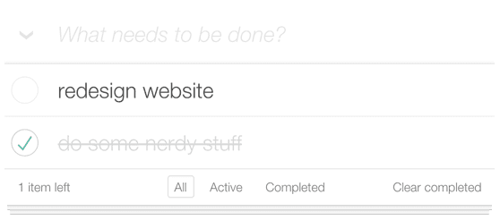
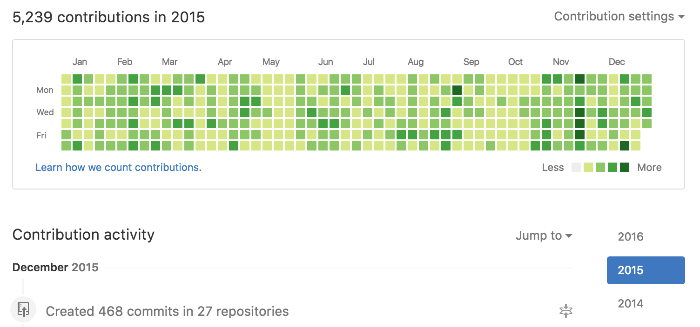
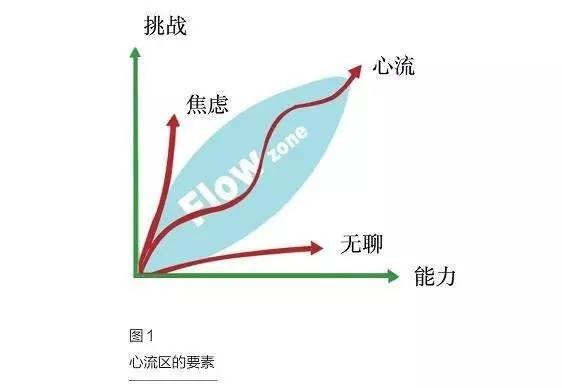
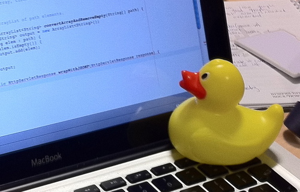
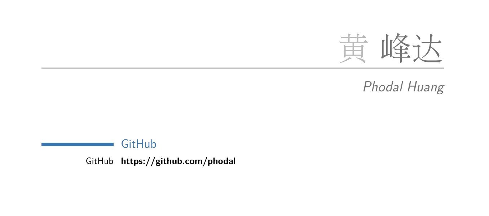
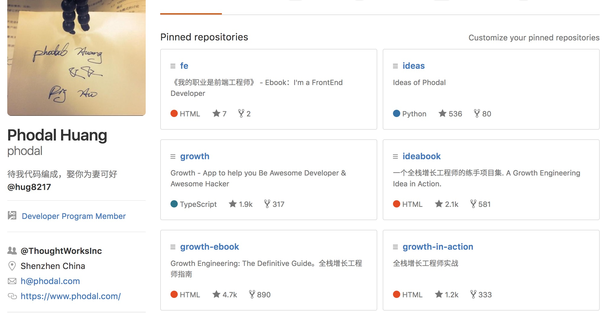
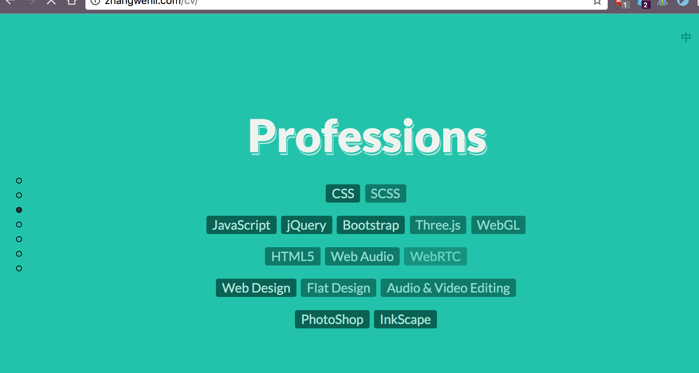
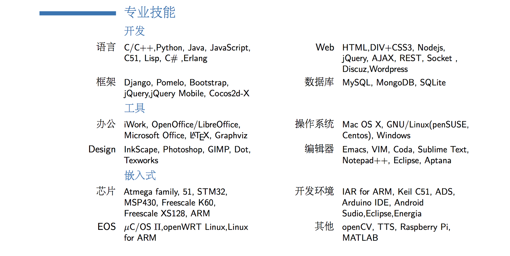
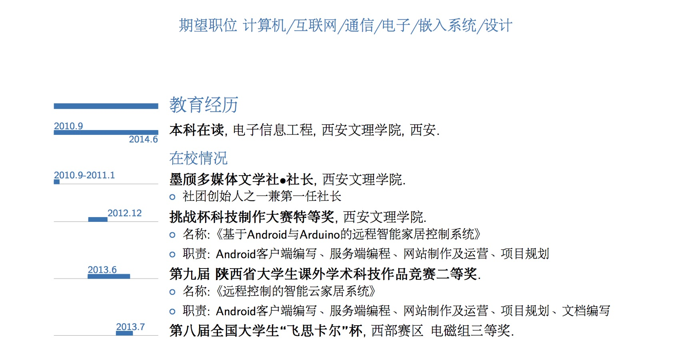
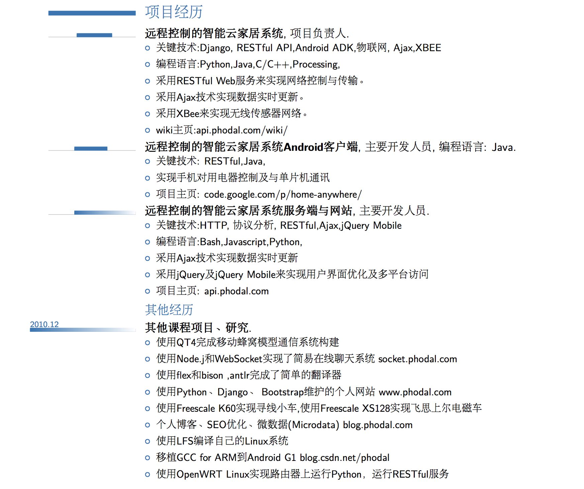

#前言

我的成长四步曲
---

在我成长初期，我制定了一些计划来实现下面的一些能力：

1. 能做到你想做的: Tasking与学习能力
2. 用更好的方法来实现功能
3. Better Code & Architecture
4. 运营(Growth Hacker)

除了第一步，每一个步骤都花费了相当长的时间来学习，光在学习方面就差不多一年了。

### 能做到你想做的: Tasking与学习能力

虽然这看上去是一件很难的事，但是也不是一件很难的事。这也不依赖于你是否对某一个技术栈的理解，这只实际上只是学习能力的一种体现。



在扯这些废话之前，先让我们来看看我们是如何实现一个功能、应用的。这也是在Growth里提到的Tasking：

1. 有一个明确的实现目标。
2. 评估目标并将其拆解成任务(TODO)。
3. 规划任务的步骤(TODO)
4. 学习相关技能
5. 执行Task，遇到难题就跳到第二步。

以本文的写作为例，细分上面的过程就是：

1. 我有了一个中心思想——在某种意义上来说就是标题。
2. 依据中心思考我将这篇文章分成了四小节。
3. 然后我开始写四小节的内容。
4. 直到完成。

而如果将其划分到一个编程任务，那么也是一样的：

1. 我们想到做一个xxx的idea。
2. 为了这个idea我们需要分成几步，或者几层设计。
3. 对于每一步，我们应该做点什么
4. 我们需要学习怎样的技能
5. 集成每一步的代码，就有了我们的系统。

所以，实际上这并不是考验你技术能力的点，而是考验你如何划分任务和学习能力的点。在我不断地实现一个个系统的时候，最后我才意识到了这一点——学习能力和Tasking才是最重要的。换句话说，你现在学会什么并不重要，重要的是你以后有没有学习的能力。

有了一直想着过安逸的生活，所以就会安乐的死去。不过反正人生在世，自己开心就行，不要管别人怎么说。随后，我发现大部分我想到的都可以实现。

那么问题来了：

1. 用铅笔写字也是写，用钢笔写字也是写，用电脑打字也是写——到底要用哪个工具来写。
2. 用楷体来显示也是显示，用宋体显示也是显示——到底要怎样的实现。

这实际上就是：用更好的方法来实现功能。

### 用更好的方法来实现功能

对于这一步来说，有太多的东西值得去探索:

1. 更好的架构
2. 更好的工具
3. 更好的语言
4. 。。。


对于语言这一点上来说，Python和Ruby是两个不同的极端，不过看上Ruby是继承Perl的思想的基础上，就不多说了。Python，一个问题只有一个方法;Ruby，一个问题有几个方法。因而在这两个语言来，想要快感就用Ruby，还有近年来流行的Scala。想要便捷就是Python，不容易出现别的问题。

而这些只是我得到的结论，每个人都会得到不同听结论的。因而，探索是一件很有意思的事~~，如图：


所以实际上，这一步是去探索一个更广阔的天空。我们需要知道不同的语言和技术栈的一些优势，了解并知道如何去应用即可。

如，以前我用的是Django的RESTful方案Tastypie管理来解决问题。后来，又发现了Django REST Framework，又用它实现了原来的逻辑。大四时，我发现PHP语言中的Laravel在RESTful这件事情上，似乎很有表现力，并且更容易“部署”——LNMP。接着实习时，发现Java在部署上更不错，它只需要一个Java包。而这个过程，只是出自于部署方面来考虑问题的。

即使现在我是一个使用Node.js的人，我还是觉得Java的打包就是优势。

在探索的过程中，我们就知道**挖掘技术哪家强**？

### Better Code & Architecture

在实际编程的过程中，我们就会遇到很多代码问题。在这时，我们尽管有好的架构，然而并不能从根本上解决问题。只能保证从蓝图上看是对的，而不能导致质量问题。


代码的腐烂都是源自于平时的工作习惯问题，而在很多时候是需求导致的。这些看上去就是噩梦——加班，没有时间学习，效率低。没有时间学习，效率低，加班。


而对于代码质量来说，也是如此的一种循环：


而在这时可以学的东西可多了，如Bad Smell，重构，设计模式，编写测试等等。

最后，我只得到了一个短句：

> 重构到设计模式

好的代码是重构出来的。

再往深层次之上就是架构，而架构往往是一种不容易得到的。尽管我看了一系列的书：

 - 《领域驱动设计》
 -  《企业应用架构模式》
 -  《领域特定语言》
 -  《恰如其份的软件架构》
 -  《面向模式的软件架构》
 -  。。。

最后，我还是依据一本书的书名，才领悟了一本书的书名《浮现式设计》。也是同样的话：

> 好的架构是演进出来的。

而这些都依赖于我们的实践，听信别人说的话，并不能让我们学会什么。只有自己做了，才知道什么是好，什么是不好。

### Growth Hacking

当我们有了一个好的Idea，一个好的架构以及一份良好的代码，并且我们还能将其执行下去。那么，我们还需要什么？


这也是我现在正在尝试的领域，也是过去我想做的，但是却找不到一个好的方向。后来，想了想就有了Growth这个APP。毕竟从一个领域到一个新的领域，最好是通过现有的领域作为过渡。

自媒体正在最近几年内崛起，同时由于聚合网站的存在，信息在不断地爆炸。一个好的作品、文章要传播起来已经越来越越难了。

在现有的领域里，知乎、微博、公众号已经开始在垄断人们的碎片时间。一个东西可能在火了几天之后，你就很难得到他的信息了。

所以在适当的时候去推销，在适当的时候持续下去。

### 小结

在那之前你需要明白的一点是，你要成为一个怎样的人？是行业的专家？还是领域的专家？等等！


我想的是一直可以做一些有趣的事，单纯深入一个垂直领域对我来说太枯燥了。对于我来说，我只会在造轮子的时候去研究一个轮子。而不是深入研究某个轮子，我会得到造某种轮子的方法。我只会在创造一些有意思的东西的时候，才会深入某个领域去学习。而不是为了深入某个领域，再去学习这个领域的知识 。。

每个人都可以用不同的方式成长，知道自己的喜欢的然后去计划。

# 内容之美

## 人生苦短，为何不写作呢？

## 分析篇：什么样的文章受欢迎？

### 文章的类型

#### 搜索引擎：完成工作

#### 聚合网站

#### 社交与新媒体

#### 小结： 大连接

## 创作篇：写作的要点

### 文章类型

#### 技术细节型

#### 干货型

#### 实践总结型

#### 杂谈与鸡汤型

### 写作要点

#### 标题

#### 小标题

#### 内容——函数体

#### 引言——README

### 文章排版

#### 可读性

#### 代码高亮

### 收集灵感

写一个博客
===

过去曾经写过一系列的文章，试图去鼓励更多的人去写文章。从毕业前的《[成为笔杆子](https://www.phodal.com/blog/think-of-rework-be-a-writer/)》、《[写作驱动学习
](https://www.phodal.com/blog/write-driven-learning/)》、《[重新思考博客的意义
](https://www.phodal.com/blog/rethink-why-write-blog/)》，到工作后的《[如何提高影响力](https://www.phodal.com/blog/how-to-improve-impact/)》，都在试图去向人们展示写博客的可以促进自己学习、提高自己的影响力。

等到工作以后，发现想写的人是没有时间，不想写的人不存在时间。人们陷入生活的怪圈，越是加班越没有时间学技术，越是没有时间学技术越是需要加班。

我尚不属于那些技术特别好的人——我只是广度特别广，从拿电烙铁到所谓的大数据。不过相比于所谓的大数据，我想我更擅长于焊电路板，笑~~。由于并非毕业于计算机专业，毕业前的实习过程中，我发现在某些特殊领域的技术比不上科班毕业的人，这意味着需要更多的学习。但是后来受益于工作近两年来从没有加班过，朝九晚六的生活带来了大量的学习时间。在这个漫长的追赶过程中，我发现开发博客相关的应用带来了很大的进步。

我的博客
---

### 现在，我的博客是如何工作的？

#### HTTP服务器

当你开发在网页上访问我的博客的时候，你可能会注意到上面的协议是HTTPS。

![blog-mobile][1]

但是并不会察觉到它是HTTP2.0。而这需要一个可以支持HTTP2.0的HTTP服务器，在不改变现在程序配置的情况下，你需要重新编译你的HTTP服务器。在这里，我的博客用的是Nginx，所以它在还只是试验版的时候，就已经被编译进去了。为了隐藏服务器的版本，还需要在编译的时候做了些手脚。除此，为了浏览器上的那个小绿锁，我们还需要一个HTTPS证书，并在Nginx上配置它。

在这时，我们还需要配置一个缓存服务器。过去，我在上面用过Varinsh、Nginx Cache。尽管对于个人博客来说，可能意义不是很大，但是总需要去尝试。于是用到了ngx_pagespeed，它会帮我们做很多事，从合并CSS、JS，到转图片转为webp格式等等。

Nginx对请求转发给了某个端口，就来到了WSGI。
 
#### WSGI

接着，我们就来到了Web服务器网关接口——是为Python语言定义的Web服务器和Web应用程序或框架之间的一种简单而通用的接口。现在，你或许已经知道了这个博客是基于Python语言的框架。但是在我们揭晓这个答案之前，我们还需要介绍个小工具——New Relic。如果你在Chrome浏览器上使用Ghosty插件，你就会看到下面的东西。

![New Relic][2]

New Relic是一个网站监测工具，Google Analytics是一个分析工具。但是，不一样的是New Relic需要在我们启动的时候加进去：

```
nohup /PATH/bin/newrelic-admin run-program /PATH/bin/gunicorn --workers=2 MK_dream.wsgi -b 0.0.0.0:8080 --timeout=300& 
```

现在这个请求总算来到了8080端口，接着到了Gunicorn的世界里，它是一个高效的Python WSGI Server。

过了上面几步这个请求终于交给了Django。

#### Django

Django这个天生带Admin的Web框架，就是适合CMS和博客。这并不意味着它的工作范围只限于此，它还有这么多用户:

![Who Use Django][3]

请求先到了Django的URL层，这个请求接着交给了View层来处理，View层访问Model层以后，与Template层一起渲染出了HTML。Django是一个MTV框架(类似于MVC之于Spring MVC)。接着，HTML先给了浏览器，浏览器继续去请求前端的内容。

它也可以用Farbic部署哦~~。

#### Angluar & Material Design Lite vs Bootstrap & jQuery Mobile

这是一个现代浏览器的前端战争。最开始，博客的前端是Bootstrap框架主导的UI，而移动端是jQuery Mobile做的(PS: Mezzanine框架原先的结构)。

接着，在我遇到了Backbone后，响应了下Martin Folwer的**编辑-发布分离模式**。用Node.js与RESTify直接读取博客的数据库做了一个REST API。Backbone就负责了相应的Detail页和List页的处理。

尽管这样做的方式可以让用户访问的速度更快，但是我相信没有一个用户会一次性的把技术博客看完。而且我博客流量的主要来源是Google和百度。

然后，我试着用Angular去写一些比较特殊的页面，如[全部文章](https://www.phodal.com/all/)。但是重写的过程并不是很顺畅，这意味着我需要重新考虑页面的渲染方式。

最后，出现了Material Design Lite，也就是现在这个丑丑的页面，还不兼容新IE（微信浏览器）。

作为一个技术博客，它也用到了HighLight.js的语法加亮。

#### API

在构建SPA的时候，做了一些API，然后就有了一个Auto Sugget的功能：

![Auto Suggest][4]

或者说，它是一个Auto Complete，可以直接借助于jQuery AutoComplete插件。

或许你已经猜到了，既然我们已经有博客详情页和列表页的API，并且我们也已经有了Auto Suggestion API。那么，我们就可以有一个APP了。

#### APP

偶然间发现了Ionic框架，它等于 = Angluar + Cordova。于是，在测试Google Indexing的时候，花了一个晚上做了博客的APP。

![Blog App][5]

我们可以在上面做搜索，搜索的时候也会有Auto Suggestion。上面的注销意味着它有登录功能，而Hybird App的登录通常可以借用于JSON Web Token。即在第一次登录的时候生成一个Token，之后的请求，如发博客、创建事件，都可以用这个Token来进行，直到Token过期。如果你是第一次在手机上访问，也许你会遇到这个没有节操的广告：

![Install Phodal Blog App][6]

然并卵，作为我的第七个Hybird应用，它只发布在Google Play上——因为不需要审核。

随后，我意识到了我需要将我的博客推送给读者，但是需要一个渠道。

###微信公众平台

借助于Wechat-Python-SDK，花了一个下午做了一个基础的公众平台。除了可以查询最新的博客和搜索，它的主要作用就是让我发我的博客了。

![Phodal QRCode][7]

对了，如果你用Python写代码，可以试试PyCharm。除了WebStorm以外，我最喜欢的IDE。因为WebStorm一直在与时俱进。


### 技术组成

So，在这个博客里会有三个用户来源，Web > 公众号 > App。

在网页上，每天大概会400个PV，其中大部分是来自Google、百度，接着就是偶尔推送的公众号，最后就是只有我一个人用的APP。。。

> Web架构

服务器：

1. Nginx(含Nginx HTTP 2.0、PageSpeed 插件)
2. Gunicorn(2 Workers) 
3. New Relic(性能监测)

DevOps: 

1. Farbic（自动部署）

Web应用后台： 

1. Mezzaine（基于Django的CMS）
2. REST Framework (API) 
3. REST Framework JWT (JSON Web Token) 
4. Wechat Python SDK
5. Mezzanine Pagedown （Markdown

Web应用前台: 

1. Material Design Lite (用户) 
2. BootStrap (后台) 
3. jQuery + jQuery.autocomplete + jquery.githubRepoWidget
4. HighLight.js 
5. Angluar.js
6. Backbone (已不维护)

移动端: 

1. Ionic
2. Angular + ngCordova
3. Cordova
4. highlightjs
5. showdown.js(Markdown Render) 
6. Angular Messages + Angular-elastic

微信端: 

1. Wechat-Python-SDK

数据分析与收集
---

### Google Analytics & WebMaster

### APM: New Relic


深入理解原理
===

hello, world
===


# 影响力

影响力 => 可信度和信任

## 分享和创造

### 为什么人们关注你？

## 技术、影响力&赚钱

### 代码、写作与分享

## 提高影响力

### 跨平台的平台：ID

天天写业务代码的那些年，我们是如何成长过来的
===

> 比起写业务代码更不幸的是，主要工作是修 Bug，bug，buG, bUg。

在一家大的公司里，不同的人总会有不同的运气：

 - 运气好的人遇上一个好的项目，升职加薪，从此就走上了人生的巅峰。
 - 运气差的人摊上一个差的项目，升不了职，少加了薪，并且还获得不了技术成长。

我刚毕业那会儿，所在团队的主要工作是，维护一个『又老又旧』的系统。比起写业务代码更不幸的是，我们的主要工作是修 Bug，bug，buG, bUg。

那一年多里，尽管都是维护旧系统和少量的新需求，我还是在飞速的成长~~。而来源主要是：

 - 组内技术活动。
 - 花时间投入练习。
 - 假想项目的重构。
 
当你在有限的条件下，还能做出一定的成绩，到底还是相当有成就感的。

只修 Bug 是怎样的一种体验
---

在这样的项目里：

 - 工作一个月时，你打开 Backlog，看看需求卡，发现那张需要三个人天的卡，好像会更有挑战一些。
 - 工作两个月时：你打开 Backlog，看看需求卡，发现完成这卡只是时间问题。
 - 工作三个月时：你打开 Backlog，看看需求卡，发现清清楚楚地知道修改哪一行。

有一天，业务人员来了一个新的需求。虽然只是加上一个新的导航，但是你总会小开心一会儿。

可你来到这样的项目时，你总会想着离开，向自己的 Buddy、PM 、Sponsor 诉说。可惜，你只是一个毕业生，太年轻了。对于你来说有挑战性的项目，不会考虑要你的。在你的感觉里，那种『自己是大公司的轮子』的感觉就特别强烈。多你一个不多，少你一个不少。你走了也不会影响这个项目，毕竟招一个人来修 bug，还是蛮轻松的。因此，这个项目走了一个又一个技术好的人，却也来不了一个技术好的人。

时间一久，每个人都充满了危机感。我们总是担心：**当你换到另外一个项目的时候，别的项目 PM 会考虑你么**——因为你是来自这个没有挑战性的项目。这个时候，你已经无路可走了，**你必须去提高你自己**。

当别人救不了你的时候，你只能自救。当别人救不了你们的时候，你们也只能自救。幸运的是，我们当时还有足够的时间，可以提高项目组的水平。于是，我们对组织了**各种的组内技术分享、workshop、培训等等**。

当你有强烈的改变意识的时候，那么事件就会变得很简单。真正可怕的是温水煮青蛙式的，而当你面对的是温水，你总会不断尝试去离开。

组内技术活动
---

当你们项目无聊的时候，总会空余一些时间。上进一点，就会创造一些学习的条件。有了条件，那么剩下的就是靠人为了。

于是乎，我们在每周挑取了两个时间，做一些技术的事情。包含了下面的一些内容：

 - 技术分享。
 - workshop。
 - kata。

不同的活动都有不同的目的，有的可以提高演讲者的技术能力，有的则是可以一起提升能力。下面就让我们详细了解一下不同的活动。 

### **技术分享**

想必大家都已经知道这个是什么了~~。当时的情况，大概是我们七个人里，每周会有两次技术分享。分享的主题会比较广泛：

**你最近在玩的技术栈**。当你们所用的项目技术栈，比较老旧的时候，就想不断地去尝试新的技术。在工作之外，便会去玩一些『新鲜』的技术栈（坑）。它就像是一股清流，即使不能帮你清除旧的污水，也能让人们看到一丝希望。而且除了能提升团队的视野，还可以将之视为替换现有架构的探索。

**项目相关的技术及业务**。在没有结对编程的项目里，共享知识对于团队来说是一个头疼的问题，而技术分享就是最简单的方式。不过，对于新人来说，**让他们做相关的技术分享才是最好的方式。**这也视作为我们对新人的考察：

 - 对于项目的了解程度
 - 找到缺少的相关知识
 - 培养新人的表达能力

在项目上，这几乎是每个新人都会经历的一个分享~~。

**特定主题的技术分享**。即，我们限定好一个大的主题，每个人挑选一个特定的主题来分享，它可以人为地提高整个组在某一领域的水平。当时我们做过 SOLID、设计模式、前端相关等特定主题的分享——每个人挑选设计模式中的一个模式，然后做相关的技术分享。当你做分享的时候，你对这模式就比较了解；而别人做分享的时候，也能引发你的思考。由于这些主题之间的相关性比较强，它可以加深对这一领域的印象。

**其他杂七杂八的内容**。过多的技术分享，可能会导致大家精疲力尽，因此就会有一些技术之外的分享。比如，你喜欢的各种动漫啊、知乎上流行的程序员女装啊等等。

而就效果来说，技术分享对于分享者的能力提升比较大，听众则是知道有这个东西，启发性一般都会比较少。如果是针对于提升能力来说，应该采用 workshop 等方式。

### **workshop**

当项目上要采用一个新的技术栈时，仅仅中是一个技术分享是不能解决问题的，你还需要有 workshop 这样的东西。比如你们将在新的项目里引入 Next.js，那么这个时候就需要有一个 Next.js Workshop。由组织者来规划每一步的内容，第一步做什么，第二步做什么，等等。参与者则是单独或者结对的形式，按照组织者的步骤一步步往下来做相关的技术练习。比如在 workshop 开始前，先 clone 并搭建好基础代码（hello, world）。开始的时候，便是先实现一个简单的 header，然后是添加样式等等。

也因此在这样的 workshop 里，我们不仅可以听过相关技术栈的知识，也能掌握一些相关技术栈的具体实践。

### **kata**

一种编程练习方式，针对某个题目反复进行操练，达到熟能生巧的目的。简单的来说，就是你一直练习某一个特别的东西，直到你习惯了。比如，对于 TDD（测试驱动开发，先写测试，并由测试驱动出功能） 的练习。

在平时工作的时候，我们不会总是习惯于 TDD 的流程：测试 -> 实现 -> 重构。特别是，当你的卡就要被打包到新的 Release 包时，**先实现总是会保证交付的**。又或者是，当你对代码库特别熟悉的时候，你可能两三分钟就改完代码，然后去喝咖啡，再回来花个十几分钟写一个测试。而当你不熟悉 TDD 的时候，你更不会采用这种方式，你会的可能就是 Test First。为了将 TDD 的思维融入你的想法里， 你就需要大量的这种练习~~。

在这个时候，我们就需要严格的按照步骤，一步步往下执行。以便于在将来，我们可以严格的按照这些步骤来执行。

除此，还有一种方式可以做，只是我们没有在这个项目里实施。

###  **dojo**

dojo，（日语：道场）。在西方世界，dōjō 一词主要指的是一个专门针对日本武术的训练场所。在敏捷团队里，Dojo 的进行方式比较『诡异』，也比较有意思。

如果你了解过结对编程的话，可能就会对两个人的结对过程比较感兴趣。按我的理解，结对编程存在着三种不同的阶段：teaching（引入门），driver-navigator（有经验与新手），结对（有经验与有经验）。即在实现功能的时候，两个人会轮流写测试和实现功能——你先写测试，我实现功能，然后换角色。而 Dojo 就是一堆人在轮流写代码：


即在有限的时间里，每个人上去实现同一功能的代码。

如，A 实现了测试，B 上去实现业务，C 上来重构。D 上来看了看，你们写的代码都是 xx，于是 Revert 之前写的代码。可惜 D 的时间也只有七分钟，所以 E 上来 Revert Revert。。。


笑~~


花时间投入练习
---

限于之前已经有相当多的文章，介绍练习相关的技巧，如：

 - 《Github 365天: 给你一年的时间，你会怎样去提高你的水平》
 - 《我的成长四步曲》
 - 《我并不聪明，只是多练习和思考》

这里就先略过去了~~，有兴趣的读者可以阅读上面的内容。总之，就是 GitHub 的一张图啦：



假想项目的重构
---

哈哈，如果

与上面的技术活动相比，这是一个对于业务更有价值，并且更容易说服别人的方式。

1. 学习别的项目的技术栈，然后将之应用到现有的系统上。
2. 使用一个新的技术栈练习， 以此作为技术支撑，在未来替换现有的系统。

小结
---

可是呢，由于我们与其他项目大组的业务是相似的，并且他们的团队规模差不多是我们的 10 倍。当某个新的应用完成后，我们要做的便是：**fork from xx**，将改吧改吧，应用到我们现有的模式上。这个时候就有问题了，一般这些新的项目都会采用最新的技术栈。在正式引入项目之前，我们都是要学习这些技能，并配合业务做一些修改。也因此，我习惯性的将这种项目视为修改 bug、bUg、Bug。

后来，我们突然有机会弯道超车了，我们可以先重构某一部分系统。『因为已经做好相关的技术积累，并没有遇上一些太大的问题』。只是我们实施一半的时候，就发生了一些意外~~。后来的后来，这个项目“到期结束”了~~

开源人生
===


# 高效

## 目标

## 激励：自我驱动的秘诀

> 一年多以前，参加过公司的一个『Management 3.0』培训。遗憾的是，没学会怎么当管理者，倒是学会了怎么驱动自己去做更多的事。

### 需求与驱动力

人呐，**主动做事**的时候，总会有动机的。如果不挨冻、不挨饿，吃饭，睡觉这种事就不需要动机的。

1. 单身的时候，主动去和异性说话，可能想的不仅仅只是交流交流——还有可能想找个人分摊房租。
2. 刚毕业的时候，多加点班多赚点钱，可能不仅仅是因为想多学点东西——还有可能是穷。
3. 写代码的时候，想写得更简洁一点，可能不仅仅是为了提高水平——还有可能是太长了，自己就看不懂了。

这就是内在的驱动力，让自己朝着自己所期望的目标前进。如我过去的 GitHub，我就是要 365 天都在写代码。

它往往比多数的外部激励更加有效。工作多年的你，可能希望少涨一些工资，因此便少加一些班。因为少加一些，你就可以：

 - 腾出点时间去与白富美约会，迎娶白富美
 - 腾出点时间去学习技术，当上 CTO
 - 腾出点时间去走上人生巅峰

好了，应该醒醒了，看看现在的你：整天提不起精神，不想写代码，也不想加班，回家了也不知道干什么。这仿佛就是学生时候的写照啊，上课的时候想着放假，可以去哪里玩，可以从某个亲戚那里拿红包；放假的时候，想着回学校看哪个美女，和谁一起去玩。除此，你还会记得你做过什么吗？

学习的时候，不情愿的去上课；工作的时候，不情愿的去上班。

好在事情并没有那么糟糕。让我们想想，你什么时候会去主动地做一些事情：

 - 因为房租涨了的缘故，你便想着多赚一些钱
 - 因为涨工资的缘故，你开始去接触更深的技术
 - 因为 KPI 的缘故，你主动地去做了一些工作

在这个过程中，你会发现有一股无形的力量在驱动着你，只是它们都是一些外在的激励。也是我们在生活中常见的激励，『干得好给你多涨工资』、『准时打卡多点奖金』、『成绩好一点排名就靠前』等等。

外部激励是在集体中最容易实现的，也是最常见的。但是效果往往不会那么理想，只有你真正想成长的时候，你才会去成长。

### 识别你的内在激励

而为了正确的激励你自己，你就需要识别出真正能影响你的内在驱动力因素。在《管理 3.0》一书中提到了十条，团队内部成员的十大需求。你需要从中选出你觉得最重要的因素，然后按顺序排好。在培训的时候，这些内容会被打印成卡片，然后两个成员一组，一个成员向另外一个成员（最好是不熟悉的两个人）解释原因。

这十条内容分别是：

即：

 - 好奇心（Curisority）。
 - 荣誉感（Honor）。
 - 认可（Acceptance）。
 - 掌握（Mastery）。
 - 权力（Power）。
 - 自由（Freedom）。
 - 相关性（Relatedness），即多与人交流。
 - 秩序（Order）。
 - 目标（Goal）。
 - 地位（Status）。

虽然这些内容都是被限定在团队范畴里的，但是我们也可以将这些内容应用到自己身上。现在，你可以从中选出最重要的三个原则，并按顺序排好。

我的顺序是：自由、好奇心、目标。

 - 自由。如现在的不加班的生活，我可以自由安排大量的时间。又如写代码是一种很无聊、乏味的工作，但是在自己掌控的代码中，我们仍然可以获得相当大的自由度。还可以有大量的时间，自由的去玩工具、造轮子。
 - 好奇心。我就是想拆拆看这个电脑，看看里面有什么东西不一样。
 - 目的。当你计划着去某个地方、实现某个功能、达成某个成就。嗯，就是这样，实现它。

有意思的是，其中有一些可能有点相似，请注意~~。注意二：在不同的时期，上面的内容都会有一些变化的。

你的顺序会是怎样的？

### Action

如果你想要的是荣誉感，那么你应该多参加一些活动。

如果你想要的是地位，那么你应该设法去做更多的领导尝试。

如果你想要的是相关性，那么你应该多去与周围的人交流。

我又编不下去了。不过，我相信你应该能找到对你来说，最重要的点。

## 有节奏的休息

经常被问及为什么我可以做这么多的事，换句话来说也就是为什么效率这么高？过去我的答案里，要么是**手快**，要么是**不加班**。后来，我发现事情并没有这么简单，于是我便想着写几章文章整理整理。

在过去的两年里，保持了GitHub近两年的连击，存档了上百个项目，还凭借18k个star上榜“GitHub Star榜Top 100”。除此，审阅了两本物联网相关的书，编写了一本物联网相关的书，和基友一起翻译了一本硬件相关的书、一本物联网相关的书，在GitHub上写了开源的电子书。

保持高效的第一要点是，**休息**。问题是我们可以怎样休息呢？

 - 睡觉
 - 吃饭
 - 走路
 - 洗澡
 - ...

这些都可以是休息。当我们讨论休息的时候，并不是指在睡觉。只要不是在忙与当前编码相关的事务，那么我们就是在休息。事实上，我们可以将“休息”这个词转变化**恢复精力**——这才是高效的第一要点。

### 休息时间

先让我们来看看在一天里，我们有多少时间是在休息的？

 - 睡觉，这是最基本的
 - 吃饭，一天三次。吃饭还得排队，又是一个多好的时间。如果你加班的话，那么你可能就是四次了。
 - 上下班时间。如果你离公司很近，那么你可以在下班的时候去逛逛。
 - 午休，运气好的话，你还可以在桌上趴会。
 - 喝水、上厕所等等。

让我们来计算一下，大致时间花费：

 - 睡觉，7~8个小时
 - 吃饭，3 * 15分钟左右 = 45分钟
 - 上下班时间，0.5小时 * 2 = 1小时
 - 午休，0.5~1小时
 - 喝水、上厕所，一天加起来也不会超过0.5小时吧。

这样算下来，一天有一半的时间都可以是休息时间。如果真的可以这样的话，那么我想你不会遇到效率的问题了~~。

#### 我的作息

之前在西安时，我作息差不多是这样的：

 - 早上七点钟起床，刷牙洗漱，然后刷GitHub，八点出门坐车。
 - 中午十二点半吃完饭，休息半个小时左右，刷刷GitHub，或者在翻译书。
 - 下午六点下班，早期坐公交回到家里，吃完饭会先睡一觉。因为是开着灯睡的，大概就十分钟左右。后来，坐上“小猪巴士”，直接在车上**睡一觉**。
 - 晚上，八点半左右才会开始写代码，十一点半上床睡觉——99%的时间是不熬夜的。

熬夜，对于我来说基本是百害而无一益，很容易影响第二天的体能和思维。因此从某种程度上来说，可以保证我有足够的精力。

而到了深圳后，主要的变化就是下班后，变成了六点走回家——50分钟左右，主要目的就是改善体能。由于这个季节，深圳的温度比西安高，回到住的地方睡不着~~，还在培养中。

并且在晚上时，有了更多的改变：

 - 忙时，十一点合上电脑、手机静音，拿起Kindle或者纸质书阅读，或者白纸装逼。
 - 闲时，十点便开始看书了。

毕竟，对于像我这样内向性格的人来说，独处才能恢复精力。对于外向性能的人来说，可能出去找几个朋友High一下就能恢复精力。

### 有节奏的休息

当你发现你养成习惯后，你就很容易进入状态。比如我在10点时，很容易就可以进入写作状态。当我按时11点半睡觉，我就可以很快进入状态，这些都是习惯造就的。

#### 按时睡觉

小时候，我们都是9点钟上传睡觉的，5，6点多起床。。。然后去叫叫隔壁的大哥哥，大姐姐出去玩。

长大了，我们都是11点钟上传睡觉的，然后7，8点起床。。。然后被隔壁的小屁孩叫醒。

从整体上来，熬夜会对身体和精神产生相对比较大的影响。如果你对**星期一综合症**或者**假期综合症**有所了解的话，那么你就会知道，只是因为你改变了习惯。

当然，如果你已经习惯了长期熬夜，并且没有负作用，那么你还是相当不错的~~。

这让我想到了猫，所以猫白天根本不理你了~~。

#### 番茄工作法

番茄工作法对于我来说，不是那么管用——天生喜欢多动，并且每天我的事务比较单一，就是编码。之所以会出现在这里，是因为它对健康有益。

我正式采用番茄工作法的原因是，在客户现场工作时，影响到颈椎了，加之我在改善尺神经卡压的影响。

这一点特别适合在工作上用，每工作25分钟，就可以休息5分钟。

所以，请使用番茄工作法作为合理的休息理由吧~~。对自己狠一点，就是对资本家好一点——除非你是资本家。

#### 碎片时间 -> 玩吧

碎片时间就适合刷刷朋友圈、逛逛微博、看看美女，看书什么的一点都不适合。

碎片时间根本不适合学习！

碎片时间根本不适合学习！

碎片时间根本不适合学习！

学习需要有高度集中的时间，你才能集中精力学习。

对了，如果你没有女朋友的话，那么你应该趁这个时间找人多聊聊天天。

#### 适当的有氧运动

>　每天应该适当做点有氧运动，如果没有女朋友的话，那么你应该出去跑步、散步啊。

只所以强调适当是因为，大量地运动不仅需要占用了你相当多的运动时间，你仍然需要相当多的时间来恢复。

而有氧运动并不仅仅局限于传统意义上的运动：跑步、打球，还可以是拖拖地。

如我最近在家里练习羽毛球颠球——转移眼睛的注意力，也算是适当的有氧运动。遗憾的是，不能在工作的地方练习。

### 小结

> 最近软件行来的的用人趋势是把人当成富士康工人用。

要成为一个大牛，就需要准备一场长期的战斗，培养自己的状态。而不是在华为干个十几年出来了，再用这十几年赚的钱去买健康，一不小心挂了怎么办？

要知道，你已经错过进入大公司最好的时机了——现在进去只能成为新一代的**富士康工人**。**你对外所说的每一句话，每一张截图，将成为你被Fire的证据。**

## 精力管理

## 习惯与快捷键

## 碎片时间

相信你已经从很大途径了解到了：“**利用碎片化时间学习**”是一个陷阱。这是一个非常有趣的事实，但是也不非可利用，比如说：聊天。那么，除了聊天我们还可以玩点什么？屏蔽朋友圈里你老板以外的咪蒙粉；到 GitHub 上给自己的开源项目点个赞；上知乎看看段子、发发广告；到微博看看前端娱乐圈。

除了利用碎片化时间是一个陷阱外，避免碎片化时间又是另外一个陷阱。

### 必然出现的碎片时间

编程作为一个脑力工作，在工作了一段时间后，你会很容易发现：**感觉身体被掏空了**。然后，你的注意力就会越来越不集中，你会想着用喝咖啡的方式来提神，会强迫自己去集中注意力。但是，这一切都于事无补。

然后，你就这样开始了糟糕的后半段时间了。于是，你就觉得你度过了糟糕的一天。

到底是哪里不对劲？你以为你是个机器，实际上你是一个人——一直百分之百运行的 CPU，也是会减寿的。

你需要一个短暂的休息——这就是为什么番茄工作法这么受欢迎的原因：**保持高效**。

既使你有一定的工作经验，也是如此。而在这时，有一个东西会影响你的工作与休息的时间，即心流：



当然，这是可遇不可求的，就好比是你和你的女神聊在一起了一样。

那么问题来了，我们如何来处理这些碎片化的时间。

### 碎片时间应该怎么玩：以收集为主

当我们有5~15分钟的碎片时间，那么你想的当然是来提高自己，而在这时最合适的方式就是：收集一些感兴趣的内容——做一个简单的判断，然后将需要的内容进行归类。如你可以将你所需要的鸡汤放到一起，来一锅大的鸡汤~~。碎片时间可以干很多事情：

 - 屏蔽朋友圈里你老板以外的咪蒙粉
 - 到 GitHub 上给自己的开源项目点个赞
 - 上知乎看看段子、发发广告
 - 到微博看看前端娱乐圈

在那之前，我们需要注意一些事项：

**避免阅读**。任何需要思考的内容都是不合适的，编程是一个脑力活。当然笑话除外：

> 小侄子早上打了个喷嚏，看他鼻子酸的要哭，我安慰他说，那是因为我在想他，他才会打喷嚏，，
下午带他出去玩，一个卖烧烤的小伙子打了两个喷嚏，这孩子冲上前去就跟人家说:“你知道吗？是我姑姑在想你呢！”

**避免思考问题**。如果有一个问题你一直无解的话，那么估计你需要一些额外的灵感，需要一些额外的知识汲入——这些知识可能与你现有的知识是无关的。

#### GitHub Trending

**最适合碎片阅读的，莫过于 GitHub Trending**。你可以在上面看到，最新的一些流行的开源项目， 如： HTTP 状态码451：基于法律上的原因，我不能向你展示网页内容。

GitHub Trending 在这方面做得特别好，有一个项目的名称和简介，只需要看一眼就够了：


能打开项目的，说明你是有兴趣的~~，加入你的 TodoLists 吧，如下：

#### 维护自己的 Awesome 列表

如果你在 GitHub 为很多项目点亮过 Star，那么你很难找到你感兴趣的项目。这时候，最理想、最简单的方式就是，创建一个简单的 README 项目来放置自己感兴趣的内容。

它可以支持“云同步”、Diff 修改、PR，还可以骗来很多的 Star。

不过，我已经习惯使用我的 Ideas 来管理了~~。

#### 看微博员工发微博

微博上关注了几个新浪微博的员工，然后每天看他们发微博，要么吐槽“渣浪食堂”。


要么吐槽时间线。

这种人要是在阿里，那肯定是不正确的。

#### 将文章加入 TodoList

如果你看到一些好的文章，那么你应该用一个 TodoList 工具：

这样你就不会看着不阅读了，同时享受划掉一个 Todo 的快感~。

看来你又有一些碎片化的时间，不妨分享到朋友圈，让大家关注一下，哈哈。


# 练习的艺术

为了更好的练习，我们可以做一些事情来提高练习的意愿：

 - 创建 Ideas 列表
 - 技术创新
 - 实践 

## 管理你的Ideas

有一句话很有意思——我们就差一个写代码的了。但是，我们经常说的是我们缺少一个idea。过去我也一直觉得我缺少一些Idea，今天发现并非如此，我们只是缺少记录的手段。

大概是在七个前，有一天我在Github上闲逛的时候，找到了一个代码库，然后习惯性的点开了作者的Profile。发现了一个名为ideas的repo，尽管里面只有简简单单地几个idea。但是这让我发现了一个新的大陆，在那之前我一直用OneNote记录我的idea（用的是Nokia Lumia 1020)。

而打开OneNote记录Idea，并不是很方便，有时候是代码，有时候是一篇博客的链接，有时候只是一段话。而且Idea出现的时候往往是在浏览一些网站的时候，Mac OS上的OneNote与Windows Phone的同步又有问题。

紧接着，我开始用Github的README.md和Issues来管理我的idea：[https://github.com/phodal/ideas](https://github.com/phodal/ideas)。

### Github管理Idea

半年时间过去了，我的Issues列表里已经关闭17个Issues，大部分是已经完成的idea。而在Open的列表里还有着12个还没开始、或者只进行了一部分的ideas。稍微看了一下，每个Idea大概隔了七天，毕竟是可遇不可求的。

如我最近解决的一个问题是——项目技术栈趋势图。而这个Idea从出现到实现只花了一天的时间，或者这算不上一个真正的Idea。而这个Idea则是依赖于另外一个Idea——技术树。同样的例子还会有很多，这和技术的演进是差不多的，Idea也是一点点演进出来的。

#### Issue

Issues一直是一个神奇的存在，你可以用它当成博客，然后下面就可以有评论。Disqus也许可以和Github合作，这样他们就会有一个巨大的市场，当然这只会是一个玩笑。

Issues是一个非常不错的『工具』，因为它可以打上Tags，你就可以通过此为你不同的Idea进行一个分类。并且每每有一个idea完成的时候，就可以关闭这个Issue了。这就好像修复一个Bug的感觉。

对于每个Idea相关的一些内容，我们都可以以Comments的形式添加相应的内容。

#### 展示Idea的README

README都会是一个项目的介绍，而且我们也可以在上面汇集我们的所有Idea。如在我的idea列表的README里已经有长长的一堆了。。

每个项目里，都会有一个简单的介绍，如EchoesWorks:

简介：Next-Generation Tech Blog/Presentation Framework

特性：

 - 支持 Markdown
 - Github代码显示
 - 全屏背景图片
 - 左/右侧图片支持
 - 进度条
 - 自动播放
 - 字幕
 - 分屏控制


在一些项目里也会有一些长长的介绍，及截图。


## 程序员如何批量生产idea

作为一个程序员都有超越BIll Gates，又Linus Torvalds一样的梦想。当然也可能没有那么远大，但是也会有当上CTO这样的想法。

一直在考虑这样的问题很久，直到有一天有了一些新的想法——这也是可以练习的。我们都知道创业就是集齐一些条件，然后持之以恒地做下去。而要集齐条件是一件很难的事，但是要练习确是一件很容易的事。

如果你可以每天抽出时间做一件事，那么再好不过了。如果一直在加班，那么这件事对你来说一定是很困难的一件事。抽出这些时间，然后做一些有针对性地学习和练习，那么就会离这个目标又进一步。

所以，这其实是一篇在说怎么去练习创建一个成功的产品的文章。这些原则可以很容易运用到创建一些开源项目上，又或者是其他类似的事情。如果你看过之前那篇《程序员如何艺术的提升技术、影响力&赚钱》，那么我想这篇文章对于你去创建一个Side Project也是很有意思的。

### 如何产生Idea：从「只差程序员」到「不差Idea」

过去我也一想在想这个问题，为什么我也没有一个好的Idea。后来，我发现只是我没有去记录，再后来我发现光有一个好的Idea也没啥用。

####「只差程序员」

「只差程序员」是一个很值得思考的问题，但是也是一个很有意思的问题。作为一个程序员，我们很容易发现对方的Idea，实现上真的不怎么样。而且如果他们差的不只是一个程序员，他们需要的是一系列的程序员。还有更多的人员，他们只是觉得程序员是万能的。

这就回到了一个问题上，既然我们是一个程序员，那么我们就占据着这个世界上的人和了。如果天时是一个好的时机的话，那么就是值得去等待了。但是作为地利的Idea，却是可以练习出来的。

这可能是你听过最有意思的笑话了~~~。

在我看对刻意地练习进行了一番尝试之后，我发现这其有无限的可能性。

### 对创新的练习：产生Idea

开始瞎说之前，让我们先看看英特尔®高级院士Gene Meieran对创新的三种类型定义：

 - 突破性创新，其特征是打破陈规，改变传统和大步跃进；
 - 渐进式创新，特征是采取下一逻辑步骤，让事物越来越美好；
 - 再运用式创新，特征是采用横向思维，以全新的方式应用原有事物。

现在，我们已经有三个可以练习的领域了。

**等等，我们从哪个领域开始？**
 
这是一个再简单不过地问题，自然是从我们擅长的领域开始——计算机。又好像是一个说了等于没说的答案，而这也是最容易练习的领域了。

在我们日常的编程工作中，我们会遇到各式各样的问题。有的人因此而创建了许多工具，有的人创建一些公司等等。只是因为这些是我们的痛点，而如果一个痛点是很多人的痛苦，那说明这是有希望的一个想法。因此，上面的三点也是三个可以练习的点。对于突破性创新来说，可能会比较难以在早期进行练习。但是对于渐进式创新来说，却是一件很容易的事。

创新是一个很有意思的话题，人们都在不断地鼓励创新。到底什么才算得上是创新？

作为一个企业想要有创新的目的莫过于：想活得更久。在多数的情况下，限制企业创新的主因便是企业本身的组织结构问题。如果一个在市场方面占有领先地方的公司做了很多创新，必然会更受尊重。Google在这方面做得不错，然而也饱受批评——毕竟，公司都是以营利为目的。如果一个产品本身达不到预期的营利要求，那么它必然会被关闭。

#### 渐近式创新：减法

在很早很早以前，我们都用过jQuery。然而这个库太大了，在早期他根本就不适合用于移动领域。相信当时也有相当多的人对其叫苦连天，于是有一个人写了一个框架叫Zepto——一个兼容jQuery API的迷你版jQuery。

去除掉那些我们不需要的功能，我们就可以获得一个新的产品。毕竟，每个人的口味都是不同的。功能越多的东西并不意味着越好，好的设计应该是添加不了新的特性，也删除不了特性。

兼容旧的浏览器本身就不是一件令人愉快的事，如果我们可以像React一样抛弃旧有的浏览器，那么我们在开始的时候就能走得更快。

#### 再运用式创新

对于这一个点就更有意思了。就是找以前的人做过的Idea，重新做一遍。在旧有的技术下不能完成的Idea，在新的技术和环境下就有可能完成了。如出生得太早的Palm掌上电脑，如果在一个新的时机重新创造的话，那么我们就可以超越原来的产品
 
实现上，你也发现了上面我们说了一堆费话。因为没有行动的话，说太多也是没用的。

记得我们的上上次Hack Day的主题是慈善，我们想做一个O2O捐赠（ps: 当然这个项目是开源的，代码放在GitHub上：[https://github.com/icharity](https://github.com/icharity)）。对于我来说，这是一次彻底的自由技术选型。

我们平时的主要语言是Java、Ruby、JavaScript，我们还使用了个古董级别的搜索引擎。尽管应用现有的系统架构可以完成我们的功能——搜索引擎保存、搜索数据，用Java语言来实现业务代码。但是在这样一个“伟大的节日”，我们还是自由地去创新。

于是，我使用了Django作为主要框架，ElasticSearch作为数据持久化，使用Node-Wechat来处理用户输入。接着在这三天里，就Happy的去写代码了。Blabla，然后就可以欢快地和人们去ShowCase了。

而这便是一个很好的再运用式创新，而这也是一个很通俗的例子。现在我已经想到了一个更简单的例子了：以前当我们不懂得设计模式的时候，我们写的代码可能看上去可以重构，但是又找不到一个好的点。而有了设计模式之后，我们便可以在我们学到的新思维用到旧有的代码里。

对于上面的例子来说也是相似的，我们已经有了旧有的技术模式，只是现在我们有了新的业务。新的业务可以匹配到我们旧有的技术框架里，旧的技术框架可以得到复用。

#### 渐进式创新

渐进式创新是一件很有意思的事，他已经和我们上面提到的“减法”相矛盾了。但是这一点似乎就是很多软件的盈利点所在——通过添加新的功能来赚钱。这也是一个非常容易理解的点，你只需要添加一些新的特性即可。不过，我想这一点已经到处都用到了，没啥说的~~。

在一次Hackday里，我们（我当时是实时生，只是在打酱油~~）用WebRTC、Arduino、Android手机、四轮小车作了一个小机器人。我们搭建了一个WebRTC的Server，手机与四轴小车做了一个漫游者，然后你可以在网页上看到小车看到的东西，并且你还可以在通过WebSocket在网页上操作他。

而我们的新Idea，便是用Oculus替换掉浏览器——我们可以用Oculus来观看远程的画面，当然还应该可以移动。尽管改变看上去很少，但是还是充满了技术挑战。

而这也是多数产品的一种路线，而这是这种路线让一个又一个的程序员加班。因为Idea本身不一定可靠，没有人能保证他们的想法一定可行。但是如果程序员不是那个出Idea的人，那么就只能任人宰割了。渐进式创新是很保守的技术创新，在现有的产品的基础上加以改进——算是加法创新。

### 开始记录你的问题/Idea

记得在那篇《[如何去管理你的Idea](https://www.phodal.com/blog/use-github-manage-idea/)》中，我们提到了用GitHub来管理Idea的想法。但是在上面记录的都是一些公开式的Idea，我们可以记录一些相似的问题。除此，我们还有一些更好的工具。

**但是，养成记录问题和Idea的习惯很重要。**
**但是，养成记录问题和Idea的习惯很重要。**
**但是，养成记录问题和Idea的习惯很重要。**

如我开始将各式各样的Idea，向我的[GitHub Repo](http://github.com/phodal/ideas)里放，如下图所示：


里面已经堆了一堆想法，有的是重复的造轮子，有的是造一些新的轮子。隔三差五地创建一个新的Issue，虽然不一定及时完成，但是可以放着看看。等老了，看看有哪些Idea已经被实现了。

除此，有一些比较隐私地Idea，会用【奇妙清单】来管理：


想法先记下来，然后再说~~。


## 造轮子

造轮子是一种快速的学习方式，而还有一种进阶则可以是从Github中生成轮子。

### 从GitHub生成轮子

使用GitHub来生成轮子，简单来说就是：  

1. 查看很多Github项目的源码及提交历史

2. 写胶水代码生成自己的框架

在这里分享之前造的几个轮子的过程：  

#### SPA框架

两年多以前，当时我们项目用的技术栈是：**Backbone** + **Mustache** + **jQuery。**在我们当时的环境下，主要组成有：  

1. Backbone提供了一个Router  
2. Mustache提供了模板  
3. jQuery抽象了DOM  
4. Ajax请求  

所以，这就是我造的第一个轮子的重要组成部分。  

接着，我就开始造轮子了：我称呼这个框架为Lettuce, [GitHub - phodal/lettuce: Mobile Framework for Romantic. 简约的移动开发框架](//link.zhihu.com/?target=https%3A//github.com/phodal/lettuce)。  

我参考了一本名为《Building A JavaScript Framework 》的电子书，以及《JavaScript框架设计》一书。因为没有任何框架的设计经验，所以只好试图按照书上的一点一滴来进行。在这个过程中，我开始深入JavaScript。  

从 [https://github.com/munro/self) 这个库中，我开始创建了自己的类的用法。  

接着，开始写Ajax，照例还是参考了jQuery和Zepto的代码。同样的还有Event、Promise等等的一些类。  

然后就是Router，源码来自于：https://krasimirtsonev.com/blog/article/A-modern-JavaScript-router-in-100-lines-history-api-pushState-hash-url，又参考了早期的Backbone代码。  

以及模板引擎，照例代码也不全是我写的，用的是http:////ejohn.org/blog/javascript-micro-templating/

最后就是一个简单的PageView:

```javascript
    var SimpleView = new Lettuce.prototype.Class({});

    SimpleView.prototype.init = function () {};

    SimpleView.prototype.render = function (template, elementId) {
        document.getElementById(elementId).innerHTML = template;
    };

    var simpleView = {
        SimpleView: SimpleView
    };

    Lettuce.prototype = Lettuce.extend(Lettuce.prototype, simpleView);

```

这其中最复杂的部分就是结合别人的代码，换句话来说，就是**写胶水代码**。Blabla，最后我就有了一个SPA框架。  

相关文章：[一步步搭建JavaScript框架——初始化项目](https://www.phodal.com/blog/build-javascript-framework-init-project/)  

**不过，这其中参考了几十个框架，这点对提升自己很重要。**  

#### Slide框架

八个多月前，当时的情形是我需要有一个可以定时放映地Slide框架，而当时大部分的框架都不能满足我的要求。  

实际上我只需要一个定时的功能，而Impress的最新代码又太复杂了。  

接着，我看了Github上的提交历史，我发现挺简单的，就自己创一个新的框架，称为[GitHub - phodal/echoesworks: Next-Generation Tech Blog/Presentation/Slider Framework](https://github.com/phodal/echoesworks)。  

我需要下面的一些元素：  

1. Markdown解析器  
2. Slide框架  
3. Github代码显示  
4. 进度条  

同样的，我在Github上搜索不同的组件，最后再把他们结合到一起。  

相关文章：  

1. [EchoesWorks —— 打造下一代技术Blog/Presentation 框架](https://www.phodal.com/blog/build-echoesworks/)  
2. [EchoesWorks构建: LocalStorage与跨Tab通信](https://www.phodal.com/blog/build-echoesworks-use-localstorage-commucation-in-tab/)  

接着，我又造了不同的几个框架：  

1. [GitHub - phodal-archive/geng: DSL Step 1 —— Parse: 天干物燥，小心火烛](https://github.com/phodal-archive/geng)  
2. [GitHub - phodal-archive/tile.js: a pure javascript tiled map render](https://github.com/phodal-archive/tile.js)  
3. [GitHub - phodal/resume: RESUME Generator](https://github.com/phodal/resume)  

随着造的轮子越来越多，写胶水代码的能力越来越强，我就开始创造一些更有意思的轮子。  

#### 三、Luffa

Luffa是最近造的一个轮子，对于不写测试的人来说可能没有那么有意思。  

我称其为基于Virtual DOM与Diff DOM的测试代码生成，[GitHub - phodal/luffa: A Test Framework Helper for Fun](//link.zhihu.com/?target=https%3A//github.com/phodal/luffa)  

当时我们项目用的是Jasmine和Jasmine jQuery作为测试框架。在写测试的时候，觉得看起来太麻烦了，就想着写一个框架来Diff DOM的变化。  

然后就是Virtual DOM那些东西了。  

virtual-dom可以说由下面几部分组成的：

1.  createElement，用于创建virtual Node。
2.  diff，顾名思义，diff算法。
3.  h，用于创建虚拟树的DSL——HyperScript。HyperScript是一个JavaScript的HyperText。
4.  patch，用于patch修改的内容。

所以，我们可以很容易地创建出一个这样的框架来Diff测试中DOM元素的修改。  


> EchoWorks


创建自己的产品
===

创业练习


### Growth 应用


# 专业

## 测试

## 代码质量

三年职业编程生涯里，遇到的那些挑战
===

>  常听人说，在我司待上三年，你就该“毕业”了。

说工作多少年总是有种秀资历的感觉，一点儿也不好，下次让我们换个口味：你的年假有多少天。

简单的来一下流水线：

 - 2013 年 12 月 30 日，开始在现在的公司实习——从一个电焊工变成了一个键盘侠。
 - 2014 年 12 月 30 日，期间挖了一个大 Bug 导致下线。
 - 2015 年 12 月 30 日，和我们家 @花仲马 手牵着手下班。
 - 2016 年 12 月 30 日，交付了第二本书，它总结了这三年（快把买书的钱准备好）。

2016 的最后一批狗粮如预期一样，已经发放完了，请期待 2017 年的狗粮。

是时候进入正题了。

实习：同侪压力
---

实习的时候的主要压力源是：同侪压力（或称同辈压力、朋辈压力，指的是同侪施加的的一种影响力，它可以鼓励一个人为了遵守团体社会规范而改变其态度、价值观、行为。）。同时进公司的同事大部分都是重点学校的研究生。这种事情落在一个二流学校的本科生身上，就是一种压力——和他们相比，你不知道究竟差了多少。即使是相差无已的，你也会觉得他们比你强。概况我又不是计算机专业的，而在大学之前我一直在为成为 Kernel Hacker 而努力着。

这种压力倒算是正向的，在为更强大的自己为努力着。然后，你就 Move Fast，也不得不 Move Fast。生怕有一天，你就落后于其他人。后来你就知道了，我开始刷 GitHub 来提高经验值、开始刷书提高理论值。那时还有一个时间段，我以每天一篇的文章在刷博客。

等毕业的时候，因为更具有挑战性，便想去尝试国内交付。通过 PM、Buddy、Sponsor 等去与上级讨论，遗憾的是都没有这样的机会。毕竟这些机会都是有限的，哪天已经长成的时候，它就会来找你，而你已经不想要了。

这段时间倒也成了成长最快的时候，没有工作上的压力，还有人指导你成长，还能在项目实战上成长。

初入职场：Interview ++ 和 Coaching 新人
--- 

开始正式工作之后，就进入了半年的试用期。虽然并不会因为有半年的适用期而影响，但是项目还是一个项目，多少就会变得有点无聊。

这时候的挑战变成了：Interview ++ 和 Coaching 新人。

度过试用期的标准是：愿意不愿意和 Ta 一起工作。但是当你在试用期的时候，就会遇到每个月的一次 Interview++。项目上的其他成员（已经过试用期）会对你进行一次组内考核，这种反馈是多方面的——不限于技术。如我在最初的时候，遇到的主要问题就是说话语速过快、普通话发音和英语问题。

后来，**语速大家习惯了**，**胡建话大家也习惯了**，**英语提高了一点，大家也习惯了**。再后来，我就去翻译书，还能愉快地用英语培训客户。

当你好不容易解决了一个反馈的时候，在下一次 Interview++ 的时候，你就会收到一个新的反馈，然后好好改正吧！少年。你就会一直在变得更好的路上，同时更加累。

入职的三星期后，七个人的团队里有四个新人（包括我）。由于我们采用结对编程的方式工作，这就不得不和其他新人结对，去 Coaching 新人。这种体验一点儿也不好，每天你都要提前做好准备，还有会遇到你的 Pair 问的各种问题。

在你也不是很熟悉快捷键的时候，还需要去教会你的 Pair 使用快捷键，你就不得不加倍去练习这些技能。当然这种成长也会更快、更累，顺便带你的小伙伴一起飞。

第二年：Be Profressional
---

当然，事情并没有这样一帆风顺。有一次，写了一个大 Bug 进去，然后上线又下线了。因为采用的是一个迭代上线一次，所以事情不算太糟糕，就是回滚到上一个迭代的版本。

这个 Bug 起先是为了 SEO（搜索引擎优化），他成功的跳过了：需要运行一小时的功能测试、数量众多的功能测试、QA 们的测试，最后是由 Google Analytics 发现了这个 Bug。同时他也困扰了我一段时间，那是我在当时找到的方法，然后也没看出大问题，就愉快地修改了。对于这个十年左右的代码库，我终究还是太年轻了。

现在，这些代码仍然在线上运行着。不过，据说已经没人会去修改这些代码了。

团队里的大部分人都是从 TWU 里出来的，同时采用了标准的结对编程流程，因此我们一直自豪的宣称：中国区对文化和敏捷遵循最好的团队。可惜，现在已经不存在了。

我们遵循着制定下的一个个软件实践：保持提交信息一致，保持持续集成的最高可用性等等。当你的持续集成是红的时候，就会有人愉快地去帮你查看失败的原因，诸如 Check Style 失败的、红过夜的是要买酸奶的。不及时修复的、修复难度比较大的，会立马被 Revert。

当你犯错的时候，记得：**Be Profressional**！

后来，在工作上的挑战也就越来越少了。

第三年：Lucky & Unlucky
---

有的人可以在三年里经历一系列的项目，刷下一堆经验值。有的人可以在三年里经历一个项目，留下一段篇章。

记得，在公司法中说：公司是指一般依法设立的，有独立的法人财产，以**营利为目的的**企业法人。当你工作的时候，一切都需要以营利为目的。如果公司营利多了，那么什么都好说。反之，你懂的。因此无论在哪，领导层都以公司的营利为核心。随后，才是公司文化，才是你的个人利益。再好的文化也会有变的一天，只有“利益是永恒”的。

因此，只要你把工作当成工作，公司当成公司，就会发现一切都很轻松。毕竟，**技术好**本身是没有价值的，有价值的是技术做好的事。

三年里只经历了两个项目，即算是一种不幸，也是一种幸运。不幸的是，从工作上能学习到的东西少之又少。幸运的是，可以有大量的时间去刷 GitHub、写博客、翻译书。

在这个时候，你总得去寻找你的下一个挑战点在哪。

我在寻找下一个挑战点，你呢？？

程序员，你真的清楚你遇到的问题吗？
===

> 作为一枚程序员，我们天生就是来解决问题的。在你不知道你的问题之前，我帮不了你，Google 也不能帮你解决问题。

大概从去年开始吧，我在思考着提升软技能上的能力。对于问题来说，能力可以分为这么几种：

 - 如何识别出问题的关键所在？分析能力
 - 如何表述清楚问题？提高表达能力
 - 能否以更清楚的形式来表达问题？如使用故事的手法？
 - 如何来指导他人解决问题？Coach

那么问题来了，当别人问你一个问题的时候，你会怎么去分析它呢？首先要对这个问题进行分类，因为**很多问题是无解的**。比如说，初学者问你：

 - 如何在 24 小时内成为前端工程师？
 - 我已经 30 岁了，应该不应该转行当程序员？
 - 大三法学生应不应该为了转行（web前端开发）而放弃司法考试？

很多时候，你只想要别人的肯定而已。

问题来源的分类
---

作为成长的一个方向，我开始去寻找一些咨询类的书籍，才了解咨询师可以分为好多种。比如说： 技术、解决方案咨询。我们需要有人来解决某个特定的问题，这个的问题是：已知的问题，但是找不到合适的解决方案。

常见的比如说，你需要一个团队转型方案，你需要有经验的人来帮你，以期降低相应的风险指数。

又比如说，我们知道我们遇到了问题，但是我们不清楚问题出自哪里。

还有一些就是，我们不知道我们不知道，我们想预测一下『黑天鹅』。

简单的来说，就是『约哈里之窗』。

最后，还有一种情况是：出于政治目的，我们需要你来证明 B 方案是比 A 方案更好的。事实上，这种问题在我们的生活中更常见。我在心里已经有了答案了，我咨询你只是为了得到一个肯定，然后就可以实施这个方案。即使，你不肯定这个方案，我也会实施的——这就是『灰犀牛』，**我们早就看到却又视而不见的危险**。

（PS：不可预测的黑天鹅，可预测、可感知、可预防的灰犀牛，他们都是两种奇葩。）

也因此，很多时候，被提问的你就是那个背锅的大头。

如何去解决问题
---

> 一旦一个问题被充分地描述了他的细节，那么解决方法也是显而易见的。

很多时候，我和别人描述了一遍问题的时候，我就已经达到了问题的答案。在这个时候，我希望你能这样去做，即**橡皮鸭子解决问题法**。所以，你只需要去问这只鸭子，你应该怎么办就好了。



当程序员遇到一个问题时：

 - **技术问题**，第一反应是 Google，第二反应是找个地方提问。
 - **职业问题**，第一反应是找信得过的，有经验的程序员。
 - bug，第一反应是这是一个 Feature，笑~~。

这些方案已经足够的清晰了。你也在很多地方看到了如何去解决问题了，我只是又重复了一遍了。当我们去询问别人如何来解决一个问题时，需要有这么一些步骤：

 - **正确识别问题**。我需要在一开始的时候，想清楚我到底遇到什么问题。这个步骤很简单，只需要看现象就可以了。
 - **描述清楚问题**。我已经找到合适的地方，合适的人来提问了。这个时候关键的点是：如何描述清楚我们遇到的问题。
 - **寻找解决方案**。有些时候，你要的答案会被直接抛出来。有些时候，被提问者会让尝试 A 再尝试 B。有些时候，你只能自己去解决问题。
 - **解决这个问题**。最后，你需要一些时间去解决问题，并学会做一些总结。

### 如何识别问题

作为一个程序员，首先**你需要尝试自己去解决这个问题**。我经常在 QQ、微信群里看到一些问题，明明就是自己搜索一下就能解决的问题，却还要去问别人。比如说：


你只需要简单的搜索一下：


现在，你遇到一个请求的参数没有发到后台？你会怎么做？ 使用浏览器的 Network 工具，查看请求是否发出去了:

   -  如果请求发出去了，那么问题就是后台的问题了。
   -  如果请求没有发生去，那么就是代码的问题了。如果是前端代码的问题的话，那么是不是这个值是空的？或者参数没有在 data 里？

再进一步去看这个问题，那么你可能就解决了这个问题了。

当你已经尝试了多次，并失败了，那么你就可以寻找合适的人，合适的地方去提问，比如说：

### 如何表述问题

向我们决定提问的时候，我们需要描述清楚我们的问题：即，**我们需要在别人的脑子里能复现问题**。我们需要描述一下当前遇到的问题：
 
  - 如何操作才出现这个问题，即提供一个重现问题的步骤。
  - 提供问题的上下文，如语言版本、操作系统等等。

如果是代码的话，请使用**高亮**、**高亮**、**高亮**的编辑器，或者截图。

总之，就是让被提问者有一个清晰的问题印象。

### 如何解决问题

列出你所需要的解决方法，一一验证它。

绝大多数情况下，只有你才能解决你的问题。我只能教你方法，或者 Coach 你，才能帮你解决这个问题。


阅读
===

虽然在我的书架上有很多的技术书籍，但是这并不代表我对每本书都很了解——但是至少每本书我都过了一下目录，大部分的书都翻了一遍。在开始瞎扯之前，先让我们过一下目录：

- 在什么情况下，我们会买技术书籍？
- 我们应该买怎样的书？
- 拿到书后，我们会怎么做？
- 书看完之后呢？
- 技术书籍，不就是花钱买时间吗？

为什么需要阅读？
---

买技术书籍的情形应该是下面的几种情况：
- 工作上使用到一些“新的技术”。对于自己来说是新技术，不代表在行业上是新技术。
- 业余生活中想尝试某个新的技术。
- xxx推荐的某本书。虽然和应用无关，但是到底是xxx推荐的。这个xxx可以是某些大牛，这可以是亚马逊——我看到亚马逊的书有好多的star，我就会买。因为在亚马逊能给书评的都是真爱。
- 探索一个新的领域。在上大学的时候，这是我最喜欢干的事，动动就去看一个无关的领域。

上面的第一、二点都是因为我们需要，所以我们才去看——这也是我们日常买书的常见原因。

读书路线
---

买什么书？
---

从出版行业来说，我最喜欢的就是动物园（O'Reilly出版社）的书，然后就是其他书籍了。但是O'Reilly出版社出的书都比较慢、慢，除此，与进到国内还需要经过翻译等等。说到翻译，不得不说图灵教育出版的翻译书籍挺不错的。

而这个行业里，最敏捷的就数Manning出版社的Manning Early Access Program，这是一个非常敏捷的出版流程。

> In MEAP, you read a book chapter-by-chapter while it's being written and get the final eBook as soon as it's finished. If you pre-order the pBook, you'll get it long before it's available in stores.

简单地说，就是当作者完成一章的内容时，你就可以阅读这一章的内容。作者在不断写作的过程中，你就可以不停地收到相关的书籍。当作者写完这本书的时候，你就读完这本书了。

可惜如果你要等中文版的书籍，差不多要等一年。并且英文版的书籍，动不动就是几百的。

因此从流程上来说，国内的出版的书籍从流程上来说会更快一些。而国内的出版现状是，写书都是为了赚名气。对比于工作时间来说，写书基本上是亏钱的买卖。更不用说，我写的六书开源电子书，就是更亏钱的买卖了。因此，**很多技术大牛都不愿意写书**。他们本身就是大牛了，不差名气、也不差钱。

因此，如果我们需要某一个领域的技术书籍。从理论上来说，最看到的是 国内的 -> Manning > Packt > O'Reilly。

因此：

- 如果要买实战类的书籍，可以直接稍微考虑一下买国内的书，然后是Manning的In Action系列、Packt的Learning系列。
- 如果要买理论系列的书籍，优先考虑国外的——国内的绝大部分大牛都不愿意写。最常见的就是机械工业出版社引进的经典系列，以及那些Prentice Hall、Apress、Addison Wesley、Pearson等等的厚书了。
- O'Reilly的大部分书籍都值得一买，以及图灵教育翻译的O'Reilly系列。

对了，**如果你看的是盗版书籍，即电子版等等，你没有资格说这本书写得烂、翻译得烂。**

## 如何阅读？

开始之前，我们需要简单地知道几点内容：
- 普通的书籍都是连续的、不可跳跃的，但是**技术书籍都是可跳跃**的。
- 技术书籍的内容都写在目录上，一眼看上去就知道发生什么了，如：第一回 宴桃园豪杰三结义，斩黄巾英雄首立功、第二回 张翼德怒鞭督邮，何国舅谋诛宦竖。
- 在以介绍某个框架、语言的书籍中，作者会不断地强调这个框架、语言的特点。

现在，我们是不是应该：

> 沐，濯发也。 浴，洒身也。 洗，洒足也。 澡，洒手也。

翻译过来就是：

> 古人读书，庄重之极，读书之前要沐浴焚香，清新敛欲，泡上一杯清茶，在茶香袅袅中，把情绪酝酿的极其饱满，然后端坐书室。 

完了，我们就可以开始看书了。一般来说，书的主要内容**要么写在前言里，要么写在第一章里**，但是它一定是在目录里的，所以可以按照这个顺序：
- 先阅读前言和第一章
- 然后看目录，找感兴趣的章节
- 最后放书籍上，装逼。
- 时不时地可以拿下来——放瓜子壳。

其实这个过程中，有一点很重要——对书的内容进行索引。换句来说，就是我们应该大概记得这本书在讲什么时候，相当于是，我们记住了这个框架、语言的一些基本属性。而正是这些构建了这些属性，我们就可以记住那些关键点，然后Google it。

如在那篇 索引 中所说：

> 人的大脑如同一间空空的小阁楼，对放置进去的家具要有选择。

书看完之后呢？
---

“当然是要放在书籍上装逼了。”

最好的效果莫过于：
- 讨论
- 实践
- 教授给他人——如写作  

### 花钱买时间

一般来说，我们都会推荐给别人去看官方文档，毕竟官方文档比较新什么的。然而有一点值得商榷的是，时间成本。阅读一本英语的原著书籍，至少能让可以读英语书籍的人读3~5本翻译书籍。

当你工作之后，你会发现这一点更不值：大部分情况下，我们需要花费几天的时间自己去探索一项新的技术，但是如果是一本书籍的话，可能就是一两个小时的事。

简历与面试
===


如何写好简历
---

> 最近收到了很多要来面试的简历，发现你们的简历怎么都是这样的呢？要是我是面试官，你们肯定进入不了下一轮。

马上就要到一年一度，最适合找工作的时间段：金三银四。另外一个时间段是：金九银十。**金三银四**的大意是：**最好的时间是三月，其次是四月**。同理于金九银十，**最好的时间是九月，其次是十月**。反正我也是在几年前，道听途说过来的。一过完年，一交流总会多些想法，就有了金三银四。金九银十则是，一些公司在年中的时候，发去年的年终奖。

今年的行情虽然没有去年火热，但是你仍应该拾掇拾掇一下你的简历，万一机会来了呢？

#### 跳槽的 N 个原因

作为一个技术人员，如果你满足以下条件中的任意一个，你应该去看看更多的机会：

 - 钱少了
 - 技术空间增长太少
 - 没有发展空间
 - 心里委屈了

以及

 - 老板招你的时候，和你谈理想。现在，老板问你说：理想能赚钱吗？
 - 加班太多——都没有时间约会或者女朋友和别人跑了
 - 你的女朋友在北京，而你在上海
 - 这个技术公司已经没有大牛了

这不是马上就要到，传说中一年一度的**狗粮节**了么。回到正题，**一份优秀的前端开发工程师简历是怎么样的？**。

### 一份优秀的前端开发工程师简历是怎么样的？

这个嘛，我觉得应该是这样的：



然后呢，HR 只需要打开这个 PDF 中的 GitHub 链接即可：



这才叫优秀嘛，你说是不是？

好了，写完段子了，让我们来看正文。

### 简历的 N 种错误姿势

这些年来，我也多多少少了，看了一些简历。也稍微有一些经验，让我先罗列一下问题，再说说原因：

### 打开姿势

**简历造假**。任何造假的行为都是不能容忍的，这个问题容易出现在不自信的面试者身上。还容易出现在培训机构的学生上——我并没有任何歧视培训机构培训的学生，我只歧视培训机构及其行为。即使你能幸运的通过面试，在工作的时候，你也有可能被觉察出来。

**不适当的文件名**。当我收到一份简历，你可以是 xxx.pdf，可以是 xx公司_xx.pdf，但是不能是 all.pdf、resume.pdf 这样的文件名。我还需要帮你重新命名一下，然后存档么？在简历的文件名上，你要突出重点，谁，需要什么岗位，如：李小明_Android工程师_简历.pdf 

**使用 PDF 以外的格式**，如PPT、DOCX、HTML。PDF 是我目前看到兼容性最好的格式，要知道 Windows 上写的 TXT 在 Mac OS 上打开都会有编码问题。DOCX 就更不用说了，我司标配的 Office 是 LibreOffice，打开的文件 100% 出问题。PPT 我就不说了，虽然很帅，但是我很累——**要面试的人是你，不是我**。



呵呵~

#### Be Professional

**语法问题**。在平时的时候，你可以将一些技术栈的单词拼错。但是在简历上，请认真一点~，最好可以找基友帮你过一遍。该大写的时候就应该大写，如 HTML 不应该写成 html 或者 Html，Java  8 不应该写在 JAVA 8 或者 java 8， 乃至 J8。

**排版问题**。像审美风格这样就算是其次的，该换行的时候就要换行，该对齐的时候就应该对齐。好在大家都是用模板来完成的，这个问题不大。

**没有项目经验或者无用的项目经验**。只是罗列技术栈，没有写你做了什么。这种感觉就好像，我在 BAT 里都干过，只不过是我是在里面扫地的。**作为一个美团外卖员工，天天进百度外卖大楼去送外卖——除了没被打死，你还有什么可以自豪的？。
**
**写了一些无关紧要的废话**。谁 TM 想知道你和你家大伯的女儿关系，以及你在中小学的时候去哪玩了。除此，你在大学的时候做的家教、兼职也不重要。你要来面试的是一份**技术工作**、**技术工作**、**技术工作**，不是销售，也不是大家老师。如果你是党员，你也不用突出你是有多爱党。毕竟，作为一个普通人，我们都拥互党的领导的。

#### 不作死

**罗列技术栈**。不要在简历上，写上太多的无关技术栈。**写到简历上的东西，都会成为你的呈堂证供。**如我毕业的时候，准备了三种不同类型的简历，嵌入式工程师的、Web 工程师的、包含两者的。然后在**专业技能**上，我列举了我玩过的各个东西。在现在看来，简直是。。。



简直是作死。当年，我写在简历上的每一个内容，**都被一一过问了一遍**。

### 程序员该如何去写自己的简历

简历就是**简单的介绍一下你自己有多 NB**。所以，你需要介绍以下的内容：

1. **我是谁**。
2. **我会什么**。
3. **做过什么**。
4. **结果如何**。

然后把这些内容放到一个模子里，就可以了。

#### 选择一套模板

如果你并非设计师，或者想要相关的求职岗位，那么请不要在简历的样式上花时间。你应该将更多的时间花费在简历的内容上吧。作为一个技术岗位，面试官想看的是你能干什么，而不是漂亮不漂亮。你又不是要面试 鼓励师程序员 =  鼓励师 + 程序员。

然后推荐下我用的模板，LaTex 里的 **modercv** 模板。就是这样的效果：


这个模板最大的优点是，写废话的地方很少。最大的缺点是：你需要学习 LaTex。你可以轻松地写上你的各种经历，并且排版出来的效果很不错。

#### 首屏加载：在第一页尽可能突出自己

这里有一个突出自己的，最好例子：

> 本人学识渊博、经验丰富，代码风骚、效率恐怖，c/c++、java、php无不精通，熟练掌握各种框架，深山苦练20余年，一天只睡4小时，千里之外定位问题，瞬息之间修复上线。身体强壮、健步如飞，可连续编程100小时不休息，讨论技术方案5小时不喝水，上至带项目、出方案，下至盗账号、威胁pm，啥都能干。泡面矿泉水已备好，学校不支持编程已辍学，家人不支持编程已断绝关系，老婆不支持编程已离婚，小孩不支持编程已送孤儿院，备用电源万兆光纤永不断电断网，门口已埋雷无人打扰

因此，你要保证 **HR 可以轻松地打开你的简历**，并且可以看到他们想要看的内容。如果你使用 GitHub Pages 和网页的时候，就要注意这个问题。并不是所有的 HR 都会翻墙的，并不是所有公司访问外网都会很轻松的。

你刚毕业不久的时候，你应该突出你在学校的成果：



工作的时候，便是突出你的公司，和 NB 的项目。

#### 毕业到工作：从看学校到看公司

校招的时候，你可以把你在学校玩过的各种东西都写在上面，如下：



就是要把你玩过的、觉得很 High 的东西都往上写。毕竟大部分人都是玩游戏过来的，然后你还玩过这么多东西，面试官对你的印象一定特定好。不过，还是那一点，**不要造假**——写到简历上的东西，都会成为你的呈堂证供。作为一个 Play for Fun 的程序员，谁的大家不是这么玩过来的。

除了这种玩可以为你加分之后，还有：

1. 211 985高校加分
2. 硕士学历加分
3. 大公司实习经验加分
4. GitHub、博客加分 
5. ACM 等比赛加分
6. 项目经验加分
7. 等等

而，等你工作多年后，教育经历就变成无关经历了。这时候加分的内容就变成：

1. BAT 等大公司加分
2. NB 的开源项目加分
3. 与本公司相关的项目经验加分
4. 行业大牛，自带光环
5. 技术栈完全匹配加分
6. GitHub、博客加分 
7. 认识 Phodal 加分 （笑~~）
8. 等等

这个世界就会从看学校到看公司。所以，如果你毕业的时候遇到这样一个选择：**大公司还是创业公司**。请考虑上这一点因素，如果这家创业公司倒了，那么你的下家就不好找了。反之，你从大公司要进入小公司，则是轻轻松松地一件事。

（PS：我的干货就到这里结束了，以下是广告时间。）

### 小结

当然了，简历再漂亮，能力不行的话，你也是进不了进一轮的。

面试
---


谈判
---

技术演讲
===

PPT的设计
---


即时演讲
---

应对提问
---

提问：这是一个好问题

重复一遍问题

收集反馈
--

# 工具箱

文档篇
---

图形工具篇
---

Chrome插件篇
---

Ops
---

硬件篇
---

CLI
---

tree
sl
cURL


写一本书
===

紧跟热门的技术是有风险的。往往你写完的时候，这本书可能已经更新了一个新版本。

那么旧的话题呢？换个思路即可，内容还可以是那些内容。

一个很好的例子，就是小说。大部分的电视剧、小说剧情上，都是你能猜到的。但是这个节目，总会有一些亮点可以吸引你，比如说主角的包子脸，俊俏的脸型，又或者是 34D 的好身材。

换个思路，重新去思考这个问题。

例子一：设计模式

GoF 的 23 个设计模式，有几个明显的问题：

 - 写得太复杂了
 - 例子用的是 C++

所以，你可以用 Java、JavaScript 去写一遍，于是你可以看到市面上已经有很多这样的书了。

写得太复杂。如 Head First 设计模式、 设计模式与重构——重构除了有 Java 版，还有 Ruby 版。

又比如说，写 Python 上 Web 开发框架的书，可以是普通的网格，后者则可以结合潮流 如 《Python Web 开发 ：测试驱动开发 的方法》

将某个语言上的应用到其他的领域，如有一本《微服务设计》的书，这本书没有提到具体的语言。面向不同的开发者，就可以有相应的实践书籍，如 Python 微服务，Node.js 微服务，Java 微服务。他们讲的内容是差不多的，无非就是自动化测试、自动化运维、持续部署、拆分服务等等。

如何去写？
---

平时有技术的去写些文章，出版的时候就结合一下这些关键点。

可以变成电子书，再是出版后的书籍。

销量
---

大 V 自然是有优势，出版社也更愿意出这一类的书——销量有保证。

如果你写的是一本冷门技术的书，又或者是国内用得比较少的书，那么出版的可能性就比较了。有一些小的出版社，出于销量的需求，就不会考虑了。

